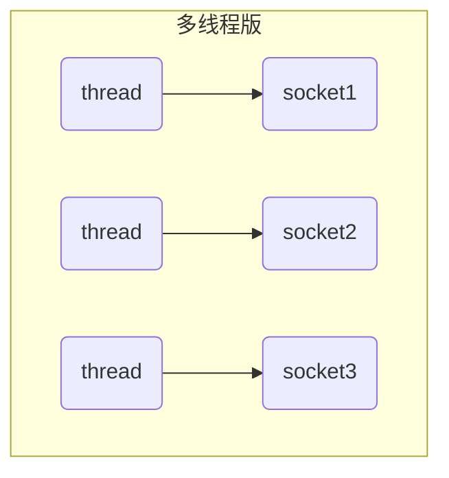
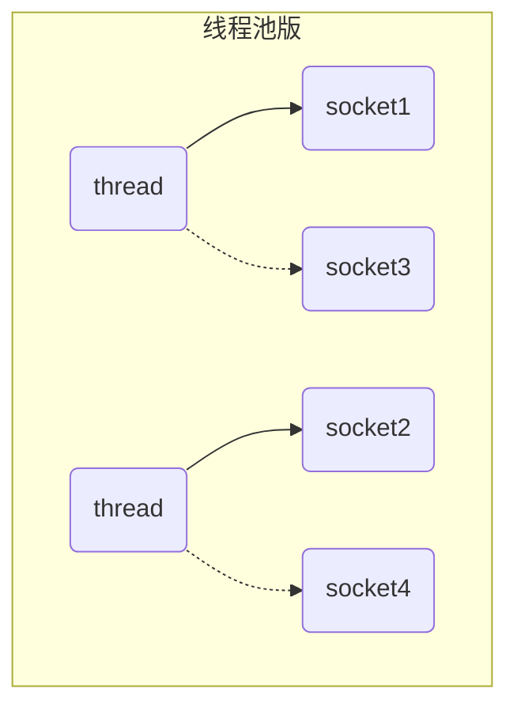
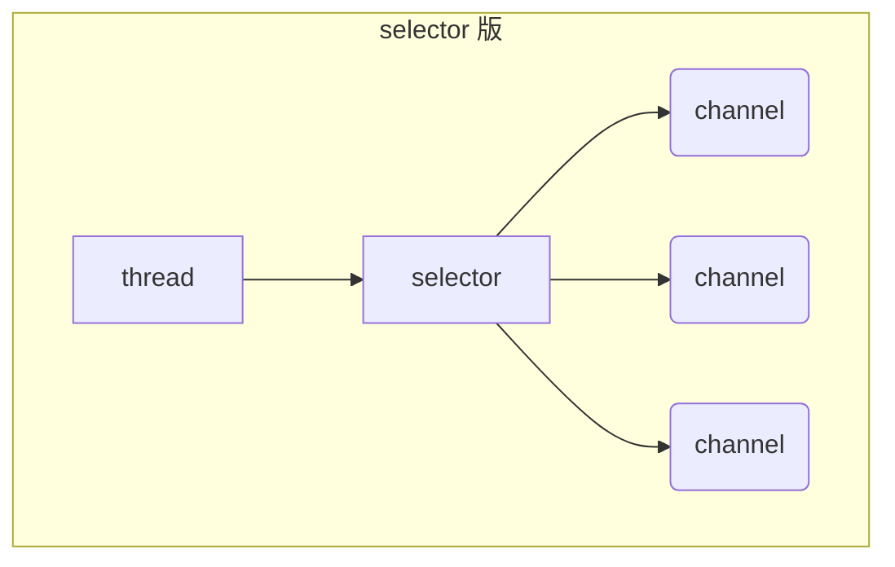

# 1 三大组件

## 1.1 Channel & Buffer

NIO 即常说的 non-blocking io，非阻塞 IO（也有人说是 New IO），其包含三大组件：Channel、Buffer 和 Selector。

Channel 类似于 Stream，它是用于读写数据的双向通道，我们可以从 Channel 中将数据读入 Buffer，也可以将缓存在 Buffer 中的数据写入 Channel。和 Steam 有所不同的是，Java 中的 Stream 往往是单向通道，即一个流要么是输入流要么是输出流，而 Channel 则是双向通道，且其相比 Stream 更为底层。常见的 Channel 有：

- FileChannel：用作文件数据传输的通道
- DatagramChannel：做 UDP 网络编程时的数据传输通道
- SocketChannel：做 TCP 数据传输的通道，客户端和服务端都能用
- ServerSocketChannel：做 TCP 数据传输的通道，专用于服务器

Buffer 则用来缓冲读写数据，常见的 Buffer 有：

- ByteBuffer：以字节为单位来缓冲数据，最常用的缓冲类，其是一个抽象类，常见实现类包括：
  - MappedByteBuffer
  - DirectByteBuffer
  - HeapByteBuffer
- ShortBuffer
- IntBuffer
- LongBuffer
- FloatBuffer
- DubleBuffer
- CharBuffer

从上述名称可以推断出来，不同类型的 Buffer 用与支持不同类型的数据的缓冲，但后面几种用得较少，使用得最多的还是 ByteBuffer 和它的实现类。

## 1.2 Selector

Selector 单从字面意思不好理解，需要结合服务器的设计演变过程来理解它的用途。

首先，作为一个服务器，必然是需要处理多个客户端的连接的，而如何达到处理多客户端连接的目的，服务器的设计思路是一步步演变的，他们经过的设计阶段有：多线程版本 BIO、线程池版本 BIO 和 NIO。

多线程版本 BIO 的设计思路为：对于每个客户端的 socket 连接，都创建一个新的线程去处理对应的实现，客户端未发送数据且不释放时，对应的线程会阻塞住，即 BIO，对应的设计思路图如下图所示。但由于线程本身会占用一定的内存资源（比如 Windows 上默认一个线程占用 1M 内存），因此若客户端数量剧增将导致大量的内存占用和线程上下文切换，故只适合连接数较少的情况。



多线程版本服务器的缺点：

- 内存占用高
- 线程上下文切换成本高
- 只适合连接数少的情况

多线程版本由于与 socket 对应的处理线程数量过多从而产生问题，因此服务器的设计进一步演变为线程池版本 BIO，其设计思路为：使用一个线程池维护处理线程以避免线程数量溢出，同时让每个线程在处理完一个连接的请求后可以继续处理其他连接，对应的设计思路图如下图所示。在该种设计思路下，虽然引入了线程池避免了线程数量溢出，但本质上还是采用基于 BIO 的一个线程对应一个 socket 的模式，同一个时间内一个线程只能处理一个 socket，当 socket 未释放时，对应的处理线程会一直阻塞住，并无法去处理其他 socket 请求，故该种模式下适合短连接的场景，故早期的很多服务器都设计为短连接的模式，采用阻塞式 IO。



线程池版本服务器的缺点：

- 阻塞模式下，线程仅能处理一个 socket 连接
- 仅适合短连接场景：很多早期的服务器为了避免阻塞，都设计为短连接的版本，发送完请求则立即关闭连接，例如早期的 Tomcat 就是这样设计的

由于 BIO 一响应一应答模型的局限性，进一步出现了 NIO 模型，其引入了 Selector 来管理多个 Channel，获取并监听在各个 Channel 上发生的事件，这些 Channel 工作在非阻塞模式下，使得处理线程不至于吊死在一个 Channel 上，适合连接数特别多但流量低的场景，其设计思路图如下图所示：



当程序调用 Selector 的 select 方法，就会阻塞直到某个 Channel 发生了读写就绪事件，当事件发生后，select 方法就会返回这些事件并交给 thread 来处理。

# 2 ByteBuffer

## 2.1 入门案例

我们使用入门案例来讲解 ByteBuffer 的使用。

首先，为了方便后续的开发，提前在 maven 中引入 netty 以及其他基本相关依赖：

```xml
<dependency>
  <groupId>io.netty</groupId>
  <artifactId>netty-all</artifactId>
  <version>4.1.77.Final</version>
</dependency>
<dependency>
  <groupId>org.projectlombok</groupId>
  <artifactId>lombok</artifactId>
  <version>1.18.22</version>
</dependency>
<dependency>
  <groupId>com.google.code.gson</groupId>
  <artifactId>gson</artifactId>
  <version>2.8.6</version>
</dependency>
<dependency>
  <groupId>com.google.guava</groupId>
  <artifactId>guava</artifactId>
  <version>31.0.1-jre</version>
</dependency>
<dependency>
  <groupId>ch.qos.logback</groupId>
  <artifactId>logback-classic</artifactId>
  <version>1.2.4</version>
</dependency>
```

我们创建一个 date.txt 文件，其内容为 `1234567890abc`，之后我们使用 nio 从文件中读取内容，首先构建该文件对应的 FileChannel，然后从 FileChannel 中读取文件到 ByteBuffer 中，最后将 ByteBuffer 转化为字符并打印，具体 demo 如下所示：

```java
import java.io.FileInputStream;
import java.io.IOException;
import java.nio.ByteBuffer;
import java.nio.channels.FileChannel;
import lombok.extern.slf4j.Slf4j;

/**
 * NIO 入门 demo，以 ByteBuffer 为例子读取 data.txt 数据并打印；
 * data.txt 内容：1234567890abc
 */
@Slf4j
public class ByteBufferTest {

    /**
     * ByteBuffer 的使用步骤一般如下：
     * 1. 读取通道数据并写入到 buffer，例如调用 channel.read(buffer)
     * 2. 调用将 buffer.flip() 将 buffer 切换到读模式
     * 3. 从 buffer 读取数据，例如 buffer.get() 为读取一个字节
     * 4. 调用 buffer.clear() 或 buffer.compact() 将 buffer 切换回写模式，让 channel 继续往里写数据
     * 5. 重复 1~4 步骤
     * @param args
     */
    public static void main(String[] args) {

        // 使用 FileChannel 读取文件，获取 FileChannel 有两种方式：
        // 1. 可以使用输入输出流（InputStream，OutputStream）获取为 FileChannel
        // 2. 可以使用 RandomAccessFile 来获取 FileChannel

        // 使用 java7 提供的 try with 语法释放资源
        try (FileChannel channel = new FileInputStream("data.txt").getChannel()) {
            // 对于 NIO，要读取数据需要先准备缓冲区，我们使用 ByteBuffer.allocate 分配缓冲区
            ByteBuffer byteBuffer = ByteBuffer.allocate(10); // 分配 10 Byte 的缓冲区

            while (true) {
                // 从 channel 读取数据并暂存到缓冲区 Buffer 中
                int len = channel.read(byteBuffer);
                if (len == -1) {
                    // EOF，读到文件尾，结束读取
                    break;
                }
                log.debug("read {} bytes...", len);

                // 逐字节打印 buffer 的内容
                byteBuffer.flip(); // 切换到 buffer 的读模式
                // 循环 buffer 逐字节读取数据
                while (byteBuffer.hasRemaining()) {
                    byte b = byteBuffer.get(); // 无参 get，一次读一个 byte
                    System.out.println((char) b); // 对于 ASCII 内的字符，可直接强转并打印
                }
                // 将 buffer 切换回写模式
                byteBuffer.clear();
            }


        } catch (IOException e) {

        }
    }
}

```

## 2.2 ByteBuffer 使用步骤

我们一般会按照下列步骤使用 ByteBuffer：

- 从 channel 向 buffer 写入数据，例如调用 channel.read(buffer)
- 调用 flip() 将 buffer 切换至读模式
- 从 buffer 读取数据，例如调用 buffer.get()
- 调用 clear() 或 compact() 将 buffer 切换至写模式，准备进行下一轮的文件数据读取
- 重复 1~4 步骤

## 2.3 ByteBuffer 结构

### 2.3.1 ByteBuffer 结构分析

ByteBuffer 本质上就是一个定长 byte 数组用作缓存，其主要有三个重要属性：

- capacity：容量，即创建 ByteBuffer 时声明的数组长度
- position：当前指针的下标，ByteBuffer 有读模式和写模式，每种模式有各自维护的 position
- limit：写入限制，初始为 capacity

刚创建 ByteBuffer 的初始状态如下图所示，其默认位于写模式，写模式下的 position 表示写入位置，故此时 `position = 0` 表示从下标 0 出开始往后逐字节写入，同时写入限制 limit 会初始化为 capacity。


在写模式下对 ByteBuffer 执行写入后，就会从写模式的 position 开始往后逐字节写入，下图为写入了 4 个字节后的状态：


假设写入完毕，之后要进行读取，当执行 `byteBuffer.flip()` 方法后，就会将 byteBuffer 转化为读模式，其会设置 `limit = position, position = 0`，转变为读模式后 ByteBuffer 的状态如下图所示：


转换为读模式后，之后便会从 `position = 0` 处开始往后读取，读取 4 个字节完毕后， ByteBuffer 的状态如下图所示：


已经读取完毕，后续可能需要继续下一轮的写入，则可以通过调用 `byteBuffer.clear()` 方法转化为写模式，其会设置 `position = 0, limit = capacity;`，即相当于会到初始状态，其状态如下图所示：


要从读模式转化为写模式，可以使用 clear() 或 compact() 方法，但不管是模式哪个方法，在转换模式时都是令 position 重新为 0 往后工作的，其中 clear 会忽视缓冲区中未读内容，直接设置 `position = 0` 后就从 0 出开始往后写入，而 compact 将当前缓冲区的未读内容从 `position = 0` 开始往后写入，然后才继续写我们的即将写入的内容；基于这两种情况，再将写模式转换为读模式后，都应该直接从 `position = 0` 处开始读取的，这也是 flip() 方法中会直接将 position 设置为 0 的原因。因此，记住一点，只要进行模式转换，必定将 position 设置为 0，其中 compact 特殊一点，但也可以看成设置为 0 后从 0 开始写入上次未读完的内容，而 clear 则相当于直接忽略未读完的内容。

### 2.3.2 ByteBuffer 调试工具类

下面的工具类可以很方便地打印 ByteBuffer 当前的缓存内容，便于学习调试：

```java
import static io.netty.util.internal.MathUtil.isOutOfBounds;
import static io.netty.util.internal.StringUtil.NEWLINE;

import io.netty.util.internal.StringUtil;
import java.nio.ByteBuffer;

public class ByteBufferUtil {
    private static final char[] BYTE2CHAR = new char[256];
    private static final char[] HEXDUMP_TABLE = new char[256 * 4];
    private static final String[] HEXPADDING = new String[16];
    private static final String[] HEXDUMP_ROWPREFIXES = new String[65536 >>> 4];
    private static final String[] BYTE2HEX = new String[256];
    private static final String[] BYTEPADDING = new String[16];

    static {
        final char[] DIGITS = "0123456789abcdef".toCharArray();
        for (int i = 0; i < 256; i++) {
            HEXDUMP_TABLE[i << 1] = DIGITS[i >>> 4 & 0x0F];
            HEXDUMP_TABLE[(i << 1) + 1] = DIGITS[i & 0x0F];
        }

        int i;

        // Generate the lookup table for hex dump paddings
        for (i = 0; i < HEXPADDING.length; i++) {
            int padding = HEXPADDING.length - i;
            StringBuilder buf = new StringBuilder(padding * 3);
            for (int j = 0; j < padding; j++) {
                buf.append("   ");
            }
            HEXPADDING[i] = buf.toString();
        }

        // Generate the lookup table for the start-offset header in each row (up to 64KiB).
        for (i = 0; i < HEXDUMP_ROWPREFIXES.length; i++) {
            StringBuilder buf = new StringBuilder(12);
            buf.append(NEWLINE);
            buf.append(Long.toHexString(i << 4 & 0xFFFFFFFFL | 0x100000000L));
            buf.setCharAt(buf.length() - 9, '|');
            buf.append('|');
            HEXDUMP_ROWPREFIXES[i] = buf.toString();
        }

        // Generate the lookup table for byte-to-hex-dump conversion
        for (i = 0; i < BYTE2HEX.length; i++) {
            BYTE2HEX[i] = ' ' + StringUtil.byteToHexStringPadded(i);
        }

        // Generate the lookup table for byte dump paddings
        for (i = 0; i < BYTEPADDING.length; i++) {
            int padding = BYTEPADDING.length - i;
            StringBuilder buf = new StringBuilder(padding);
            for (int j = 0; j < padding; j++) {
                buf.append(' ');
            }
            BYTEPADDING[i] = buf.toString();
        }

        // Generate the lookup table for byte-to-char conversion
        for (i = 0; i < BYTE2CHAR.length; i++) {
            if (i <= 0x1f || i >= 0x7f) {
                BYTE2CHAR[i] = '.';
            } else {
                BYTE2CHAR[i] = (char) i;
            }
        }
    }

    /**
     * 打印所有内容
     * @param buffer
     */
    public static void debugAll(ByteBuffer buffer) {
        int oldlimit = buffer.limit();
        buffer.limit(buffer.capacity());
        StringBuilder origin = new StringBuilder(256);
        appendPrettyHexDump(origin, buffer, 0, buffer.capacity());
        System.out.println("+--------+-------------------- all ------------------------+----------------+");
        System.out.printf("position: [%d], limit: [%d]\n", buffer.position(), oldlimit);
        System.out.println(origin);
        buffer.limit(oldlimit);
    }

    /**
     * 打印可读取内容
     * @param buffer
     */
    public static void debugRead(ByteBuffer buffer) {
        StringBuilder builder = new StringBuilder(256);
        appendPrettyHexDump(builder, buffer, buffer.position(), buffer.limit() - buffer.position());
        System.out.println("+--------+-------------------- read -----------------------+----------------+");
        System.out.printf("position: [%d], limit: [%d]\n", buffer.position(), buffer.limit());
        System.out.println(builder);
    }

    private static void appendPrettyHexDump(StringBuilder dump, ByteBuffer buf, int offset, int length) {
        if (isOutOfBounds(offset, length, buf.capacity())) {
            throw new IndexOutOfBoundsException(
                "expected: " + "0 <= offset(" + offset + ") <= offset + length(" + length
                    + ") <= " + "buf.capacity(" + buf.capacity() + ')');
        }
        if (length == 0) {
            return;
        }
        dump.append(
            "         +-------------------------------------------------+" +
                NEWLINE + "         |  0  1  2  3  4  5  6  7  8  9  a  b  c  d  e  f |" +
                NEWLINE + "+--------+-------------------------------------------------+----------------+");

        final int startIndex = offset;
        final int fullRows = length >>> 4;
        final int remainder = length & 0xF;

        // Dump the rows which have 16 bytes.
        for (int row = 0; row < fullRows; row++) {
            int rowStartIndex = (row << 4) + startIndex;

            // Per-row prefix.
            appendHexDumpRowPrefix(dump, row, rowStartIndex);

            // Hex dump
            int rowEndIndex = rowStartIndex + 16;
            for (int j = rowStartIndex; j < rowEndIndex; j++) {
                dump.append(BYTE2HEX[getUnsignedByte(buf, j)]);
            }
            dump.append(" |");

            // ASCII dump
            for (int j = rowStartIndex; j < rowEndIndex; j++) {
                dump.append(BYTE2CHAR[getUnsignedByte(buf, j)]);
            }
            dump.append('|');
        }

        // Dump the last row which has less than 16 bytes.
        if (remainder != 0) {
            int rowStartIndex = (fullRows << 4) + startIndex;
            appendHexDumpRowPrefix(dump, fullRows, rowStartIndex);

            // Hex dump
            int rowEndIndex = rowStartIndex + remainder;
            for (int j = rowStartIndex; j < rowEndIndex; j++) {
                dump.append(BYTE2HEX[getUnsignedByte(buf, j)]);
            }
            dump.append(HEXPADDING[remainder]);
            dump.append(" |");

            // Ascii dump
            for (int j = rowStartIndex; j < rowEndIndex; j++) {
                dump.append(BYTE2CHAR[getUnsignedByte(buf, j)]);
            }
            dump.append(BYTEPADDING[remainder]);
            dump.append('|');
        }

        dump.append(NEWLINE +
            "+--------+-------------------------------------------------+----------------+");
    }

    private static void appendHexDumpRowPrefix(StringBuilder dump, int row, int rowStartIndex) {
        if (row < HEXDUMP_ROWPREFIXES.length) {
            dump.append(HEXDUMP_ROWPREFIXES[row]);
        } else {
            dump.append(NEWLINE);
            dump.append(Long.toHexString(rowStartIndex & 0xFFFFFFFFL | 0x100000000L));
            dump.setCharAt(dump.length() - 9, '|');
            dump.append('|');
        }
    }

    public static short getUnsignedByte(ByteBuffer buffer, int index) {
        return (short) (buffer.get(index) & 0xFF);
    }
}
```

### 2.3.3 ByteBuffer 结构简单验证

下面的代码对 ByteBuffer 的结构做了简单的验证，首先

```java
@Slf4j
public class ByteBufferTest {

    public static void main(String[] args) {

        // 分配 16 字节的缓冲
        ByteBuffer byteBuffer = ByteBuffer.allocate(10);

        // 默认为写模式，写入 a b c d e 的 ASCII
        for (int i = 0; i < 5; i++) {
            byteBuffer.put((byte) (0x61 + i));
        }
        // 调用工具查看缓冲区
        debugAll(byteBuffer);

        // 读写模式有自己的 position
        // 若不切换为读模式，从当前写模式的 position=5 处开始读，会读到 0，同时会导致下次写入跳过该位置
        System.out.println("read position = 5: " + byteBuffer.get()); // 读到 0

        // 继续写入，会跳过 position=6 位置，即 f 被写入 position=6 的位置
        byteBuffer.put((byte) (byte) 'f');
        debugAll(byteBuffer);

        // 切换为读模式，position 变为 0 并往后开始读取
        byteBuffer.flip();
        System.out.println("read position = 0: " + byteBuffer.get());
        System.out.println("read position = 1: " + byteBuffer.get());
        System.out.println("read position = 2: " + byteBuffer.get());

        // 之后打印缓冲区剩余内容
        debugAll(byteBuffer);
    }
}

// 上述代码打印下述结果：
+--------+-------------------- all ------------------------+----------------+
position: [5], limit: [10]
         +-------------------------------------------------+
         |  0  1  2  3  4  5  6  7  8  9  a  b  c  d  e  f |
+--------+-------------------------------------------------+----------------+
|00000000| 61 62 63 64 65 00 00 00 00 00                   |abcde.....      |
+--------+-------------------------------------------------+----------------+
read position = 5: 0
+--------+-------------------- all ------------------------+----------------+
position: [7], limit: [10]
         +-------------------------------------------------+
         |  0  1  2  3  4  5  6  7  8  9  a  b  c  d  e  f |
+--------+-------------------------------------------------+----------------+
|00000000| 61 62 63 64 65 00 66 00 00 00                   |abcde.f...      |
+--------+-------------------------------------------------+----------------+
read position = 0: 97
read position = 1: 98
read position = 2: 99
+--------+-------------------- all ------------------------+----------------+
position: [3], limit: [7]
         +-------------------------------------------------+
         |  0  1  2  3  4  5  6  7  8  9  a  b  c  d  e  f |
+--------+-------------------------------------------------+----------------+
|00000000| 61 62 63 64 65 00 66 00 00 00                   |abcde.f...      |
+--------+-------------------------------------------------+----------------+
```

## 2.4 ByteBuffer 常用方法

### 2.4.1 分配空间

使用 `ByteBuffer.allocation(int)` 分配空间，其会返回一个 byteBuffer 实例

```java
ByteBuffer buf = ByteBuffer.allocate(16);
```

### 2.4.2 向 ByteBuffer 实例写入数据

向 ByteBuffer 实例写入数据有两种方法：

- 调用 channel 的 read(byteBuffer) 方法，其会从 channel 读取数据并写入到 byteBuffer
- 调用 byteBuffer 自身的 put 方法直接写入数据

```java
// 从 channel 中读取并写入 buf
int readBytes = channel.read(buf);

// 调用 bf 自身的 put 方法
buf.put((byte) 127);
```

### 2.4.3 从 ByteBuffer 实例读取数据

从 ByteBuffer 实例读取数据同样有两种方法：

- 调用 channel 的 write 方法会从 byteBuffer 读取数据并写入到 channel 中
- 直接调用 byteBuffer.get() 或 byteBuffer.get(i) 方法从 byteBuffer 读取数据

```java
// 从 buf 读取数据并写入到 channel 中
int writeBytes = channel.write(buf);

// 直接调用 bf 自身的 get 方法读取数据
byte b = buf.get();
byte c = buf.get(0);
```

其中 get() 方法会让 position 指针往后移动，如果想重复读取数据，可以：

- 调用 rewind 方法将 position 重置为 0，从头读取
- 调用 get(int i) 方法可以直接获取指定位置 i 的内容，它不会移动 position 指针

下面是对 put, get 和 rewind 方法的简单测试：

```java
public class ByteBufferTest {

    // 连续读取两个字符并打印在一行
    private static void printTwoCharacter(ByteBuffer buffer) {
        System.out.print((char)buffer.get());
        System.out.print((char)buffer.get());
        System.out.println();
    }

    public static void main(String[] args) {
        ByteBuffer buffer = ByteBuffer.allocate(10);
        buffer.put(new byte[]{'a', 'b', 'c', 'd'});

        // 切换到读模式
        buffer.flip();

        // 读取 ab
        printTwoCharacter(buffer);
        // 读取 cd
        printTwoCharacter(buffer);

        // 将 position 重置为 0
        buffer.rewind();

        // 读取 ab
        printTwoCharacter(buffer);

        // get(i) 不会改变 position 指针，直接读取指定位置的内容
        // 读取 ac
        System.out.print((char)buffer.get(0));
        System.out.print((char)buffer.get(2));
    }
}
```

### 2.4.4 mark 和 reset

mark() 可以在当前 position 指针所在位置添加一个标记，当调用 reset 方法时则

下面是对 mark 和 reset 的简单测试代码：

```java
public class ByteBufferTest {

    // 连续读取两个字符并打印在一行
    private static void printTwoCharacter(ByteBuffer buffer) {
        System.out.print((char)buffer.get());
        System.out.print((char)buffer.get());
        System.out.println();
    }

    public static void main(String[] args) {
        ByteBuffer buffer = ByteBuffer.allocate(10);
        buffer.put(new byte[]{'a', 'b', 'c', 'd'});

        // 切换到读模式
        buffer.flip();

        // 读取 ab
        printTwoCharacter(buffer);

        // 使用 mark 标记 position = 2 的位置
        buffer.mark();

        // 读取 cd
        printTwoCharacter(buffer);

        // 使用 reset 将 position 设置为上次标记的位置，此处 = 2
        buffer.reset();
        printTwoCharacter(buffer);

        // 再次使用 reset 将 position 设置为上次标记的位置，此处 = 2
        buffer.reset();
        printTwoCharacter(buffer);
    }
}
```

### 2.4.5 字符串与 ByteBuffer 互转

我们知道 ByteBuffer 存储的本质就是字节数组，因此字符串和 ByteBuffer 的互转就是基于字符串的字节数组来实现的。

从字符串转化为 ByteBuffer 本质上就是需要获取字符串在某一编码下的字节数组，然后将字节数组写入到 ByteBuffer 中，常见有下列三种写法：

- 原始方式：自己创建合适长度的 ByteBuffer 实例并存储字符串指定编码的字节数组
- 使用 Charset.encode 方法：Charset 是由 nio 定义的一个抽象编码类，并提供常见的字符编码的匿名实现实例，使用指定实现类的 encode 方法便可以直接获取对应的 ByteBuffer，同时启会自动切换为读模式
- 使用 ByteBuffer.wrap(byte[]) 方法：也可以在获取字符串某一编码的字节数组后，直接使用 wrap 包装为 ByteBuffer，该方法同样会自动转换为读模式

而从 ByteBuffer 转换为字符串，本质上就是从 ByteBuffer 中读取到字节数组，并按指定编码解码为字符串即可，常见有两种写法：

- 原始方式：仍然自己手动从 byteBuffer 读到字节数组，然后以指定字节数组和字符编码的方式创建字符串即可
- 使用 Charset.decode 方法：可以直接使用指定字符编码对应的 Charset 实例的 decode 方法，从 ByteBuffer 中获得转换，其得到的是一个 CharBuffer，调用 toString 即可获得字符串

下列代码测试了字符串与 ByteBuffer 的互转，主要基于 UTF-8 编码进行：

```java
public class ByteBufferTest {

    public static void main(String[] args) {
        String s = "hello世界";

        System.out.println("--------------字符串转化为 ByteBuffer------------");
        // 方式一：采用原始方式，直接获取字符串的 bytes，并自己创建 byteBuffer 进行读写
        // 该种方式不会自动切换为读模式，因为是我们自己手动创建的 byteBuffer，因此要读取并转换回字符串要调用 flip()
        ByteBuffer simpleBuffer = ByteBuffer.allocate(11);
        simpleBuffer.put(s.getBytes(StandardCharsets.UTF_8));
        debugAll(simpleBuffer);

        // 方式二：使用 nio 提供的 Charset.encode(String) 方法
        // Charset 为抽象字符类，有不同的子实现类，每一种实现类都对应一种编码
        // 该种方式会在内部创建并返回 ByteBuffer，同时会自动切换为读模式
        ByteBuffer encodeBuffer = StandardCharsets.UTF_8.encode(s);
        debugAll(encodeBuffer);

        // 方式三：使用 wrap 包装字节数组
        // 同样该种方式会在内部创建并返回 ByteBuffer，同时会自动切换为读模式
        ByteBuffer wrapBuffer = ByteBuffer.wrap(s.getBytes(StandardCharsets.UTF_8));
        debugAll(wrapBuffer);

        System.out.println("--------------ByteBuffer 转化为字符串------------");
        // 方式一：手动处理，自己从 byteBuffer 读出字节数组并转化为字符串
        // 采用 get(i) 的读取方式，不依赖读模式，不影响 position
        byte[] bytes = new byte[simpleBuffer.position()];
        for (int i = 0; i < bytes.length; i++) {
            bytes[i] = simpleBuffer.get(i);
        }
        System.out.println(new String(bytes, StandardCharsets.UTF_8));

        // 方式二：使用 Charset.decode() 方法
        // 对于自己创建的 byteBuffer，必须先转化为读模式，才可以成功读取并转化为字符串
        simpleBuffer.flip();
        System.out.println(StandardCharsets.UTF_8.decode(simpleBuffer));
        System.out.println(StandardCharsets.UTF_8.decode(encodeBuffer));
        System.out.println(StandardCharsets.UTF_8.decode(wrapBuffer));
    }
}
```

## 2.5 分散读取 Scattering Reads

假设有一段文本 parts.txt，其内容如下，我们需要分别读取出三个单词，则可以采用分散读取的功能

```text
onetwothree
```

分散读取时可以提供一个 ByteBuffer 数组，其会逐步从前往后填满 ByteBuffer，因此我们提供一个长度为 3 的 ByteBuffer 数组，各个 ByteBuffer 的长度分别为 3、3、5 即可成功分散读取，示例代码如下：

```java
public class ByteBufferTest {
    // parts.txt 内容为：onetwothree
    public static void main(String[] args) {
        try (RandomAccessFile file = new RandomAccessFile("parts.txt", "rw")) {
            FileChannel channel = file.getChannel();

            ByteBuffer b1 = ByteBuffer.allocate(3);
            ByteBuffer b2 = ByteBuffer.allocate(3);
            ByteBuffer b3 = ByteBuffer.allocate(5);

            // 使用分散读取，会自动填满 b1, b2, b3
            channel.read(new ByteBuffer[]{b1, b2, b3});

            // 切换为读模式后打印内容
            b1.flip();
            b2.flip();
            b3.flip();
            System.out.println(StandardCharsets.UTF_8.decode(b1));
            System.out.println(StandardCharsets.UTF_8.decode(b2));
            System.out.println(StandardCharsets.UTF_8.decode(b3));
        } catch (IOException e) {

        }
    }
}
```

## 2.6 聚合写入 Gathering Writes

假设现在有三个 ByteBuffer，现在想将这三个 ByteBuffer 写入到一个文件，主要有两种思路：

- 可以对通道调用三次写入方法，但这样存在多次 IO，效率较低
- 还可以采用聚合写入的方式，直接提供一个长度为 3 的 ByteBuffer 数组，Channel 会自动按序合并多个 ByteBuffer 为一个并执行写入，该种方式只会触发一次 IO

下面为聚合写入的简单测试代码，即以聚合写入的方式将字符串 `hello, world!` 写入到文件：

```java
public class ByteBufferTest {
    public static void main(String[] args) {
        try (FileOutputStream file = new FileOutputStream("data.txt")) {
            FileChannel channel = file.getChannel();

            ByteBuffer b1 = ByteBuffer.wrap("hello".getBytes());
            ByteBuffer b2 = ByteBuffer.wrap(", ".getBytes());
            ByteBuffer b3 = ByteBuffer.wrap("world!".getBytes());

            channel.write(new ByteBuffer[]{b1, b2, b3});
        } catch (IOException e) {

        }
    }
}
```

## 2.7 综合练习：粘包半包解析

网络上有多条数据发送给服务端，数据之间使用 `\n` 进行分隔，但由于某种原因这些数据在接收时，被进行了重新组合，例如原始数据有 3 条为：

- Hello,world\n
- I'm zhangsan\n
- How are you?\n

但由于网络传输中黏包和半包的原因，变成了下面的两个 byteBuffer (黏包，半包)

- Hello,world\nI'm zhangsan\nHo
- w are you?\n

现在要求你编写程序，将错乱的数据恢复成原始的按 `\n` 分隔的数据

针对上述需求，实现代码如下：

```java
public class ByteBufferTest {

    public static void main(String[] args) {
        ByteBuffer source = ByteBuffer.allocate(32);
        source.put("Hello,world\nI'm zhangsan\nHo".getBytes());
        split(source);

        // 注意最后如果不加 \n 分割符，最后一个会被当做还没传输完毕不打印
        source.put("w are you?\nhaha!\n".getBytes());
        split(source);
    }

    // 不消耗的形式进行打印字符，只支持 ASCII
    private static void print(ByteBuffer byteBuffer) {
        byteBuffer.flip();

        // 切换到读模式拿到 limit，确定可打印部分为 [0, limit)
        int limit = byteBuffer.limit();
        for (int i = 0; i < limit; i++) {
            System.out.print((char)byteBuffer.get(i));
        }
        System.out.println();

        // 切换回写模式，不会对原内容有影响，可继续写
        byteBuffer.compact();
    }

    private static void split(ByteBuffer source) {
        // 切换为读模式，进行读取操作
        source.flip();

        // 获取可读的 limit
        int limit = source.limit();

        for (int i = 0; i < limit; i++) {
            // 检测到分割符，则表示当前读模式的 [position, i] 为完整字符串，可以读取并打印
            // 读取完毕后，将 position 变为 i + 1
            if (source.get(i) == '\n') {
                // 我们同样声明一个新的 ByteBuffer 存储这个完整的字符串
                int len = i - source.position() + 1;
                ByteBuffer target = ByteBuffer.allocate(len);
                // 从 source 中读取并写入到 target 中，由于只能读取到分割符处，因此要设置 source 的 limit
                source.limit(i + 1);
                target.put(source);
                // 打印读取到的 target
                print(target);

                // 读取完毕后，要恢复原有 limit
                source.limit(limit);
            }
        }

        // 切换回写模式继续后续写入，注意要使用 compact 因为缓冲区可能还存在不完整的未读取的字节
        source.compact();
    }
}
```

## 2.8 补充

### 2.8.1 ByteBuffer 常见实现类

ByteBuffer 有两个最常见的实现类，分别是 `java.nio.HeapByteBuffer` 和 `java.nio.DirectByteBuffer`。其中 HeapByteBuffer 分配在堆内存上，读写效率较低，会受到 GC 的影响（GC 时会拷贝，变换存储位置等）。而 DirectByteBuffer 分配在直接内存上，读写效率较高（少一次拷贝），且不会受到 GC 影响，但分配的效率较低。

```java
public class ByteBufferTest {
    public static void main(String[] args) {
        System.out.println(ByteBuffer.allocate(16).getClass());
        System.out.println(ByteBuffer.allocateDirect(16).getClass());
    }
}
```

# 3 文件编程

## 3.1 FileChannel

FileChannel 我们前面在读写文件时已经用过，其是用于文件读写的通道。注意 FileChannel 只能工作在阻塞模式下，无法和 Selector 配合完成非阻塞式的 IO，只有我们后面介绍的和网络相关的 SocketChannel，才能和 Selector 配合工作在非阻塞模式下。

如何获取 FileChannel：不能直接打开 FileChannel，而必须通过 FileInputStream、FileOutputStream 或 RandomAccessFile 来获取 FileChannel，它们都有 getFileChannel 方法。此外，FileChannel 虽然是可读可写的，但是根据获取 FileChannel 的源头就已经决定了该 FileChannel 是可读的还是可写的：

- 通过 FileInputStream 获取的 channel 只能读
- 通过 FileOutputStream 获取的 channel 只能写
- 通过 RandomAccessFile 是否能读写由构造 RandomAccessFile 时传入的读写模式决定

### 3.1.1 读取

对于 FileChannel 的读取操作，首先要准备一个写模式的 ByteBuffer，然后从 FileChannel 读取数据并写到 ByteBuffer 中：

```java
int readBytes = channel.read(buffer);
```

### 3.1.2 写入

对于 FileChannel 的写入操作，需要将要写入的数据缓存在一个读模式的 ByteBuffer 中，然后调用 FileChannel 的 write 方法进行写入。

```java
while (buffer.hasRemaining()) {
    channel.write(buffer);
}
```

此外，需要注意的是，上述代码中，我们的写入是写在循环中的。对于 FileChannel，其传输能力没有限制，一次 write 就可以写完毕了，那么可以不需要循环，但是对于后续网络编程的 SockeChannel，其传输数据的能力是有限的，未必能一次性传输完 Buffer 中的所有内容，因此要采用循环写入的方式。

下面是基于 FileChannel 和 ByteBuffer 实现的文件拷贝的函数：

```java
public class ByteBufferTest {
    private static void copy(String from, String to) {
        try (
            FileInputStream fromStream = new FileInputStream(from);
            FileOutputStream toStream = new FileOutputStream(to);
            FileChannel fromChannel = fromStream.getChannel();
            FileChannel toChannel = toStream.getChannel();
        ) {
            final ByteBuffer buffer = ByteBuffer.allocate(20);
            int readBytes;
            while ((readBytes = fromChannel.read(buffer)) != -1) {
                buffer.flip();
                while (buffer.hasRemaining()) {
                    toChannel.write(buffer);
                }
                buffer.compact();
            }
        } catch(IOException e) {
            throw new RuntimeException(e);
        }
    }

    public static void main(String[] args) throws FileNotFoundException {
        copy("data.txt", "data2.txt");
    }
}
```

注意，需要在 while 中循环调用 channel.write()，因为只调用一次 write 方法并不能保证将 buffer 中的全部内容写入到 channel 中。

### 3.1.3 关闭

Channel 必须关闭，但调用了 FileInputStream、FileOutputStream 和 RandomAccessFile 的 close 方法会间接地调用 channel 的 close 方法

### 3.1.4 位置

FileChannel 内部也维护了一个 position，表示当前读取到文件位置。

可以使用 position() 方法获取和设置文件通道的当前位置，示例代码如下：

```java
// 获取 position 位置
long pos = channel.position()

// 设置 position 位置
channel.position(val);
```

需要注意，设置 position 时，如果设置为文件的末尾，此时读取会返回 -1，且继续写入会以追加的形式将内容追加到文件尾，但如果设置的 position 的值超过了文件末尾，写入时在新内容和原末尾之间会多出多余的 0。

### 3.1.5 大小

使用 size() 方法获取文件的大小

### 3.1.6 强制写入

操作系统出于性能的考虑，会将数据缓存，不是立刻写入磁盘，可以调用 `force(true)` 方法将文件内容和元数据（文件的权限等信息）立刻写入磁盘。

## 3.2 两个 Channel 传输数据

两个 Channel 之间可以直接使用 `transferTo(源通道拷贝起始位置， 拷贝大小， 目标通道)` 方法传输数据并返回实际传输字节数，且该方法比我们自己读写文件效率更高，因为操作系统底层会利用零拷贝技术进行优化

例如，下述代码实现了文件的拷贝，相比前面我们自己创建 buffer 进行拷贝更加地简洁：

```java
public class ByteBufferTest {
    private static void copy(String from, String to) {
        try (
            FileChannel fromChannel = new FileInputStream(from).getChannel();
            FileChannel toChannel = new FileOutputStream(to).getChannel();
        ) {
            fromChannel.transferTo(0, fromChannel.size(), toChannel);
        } catch(IOException e) {
            throw new RuntimeException(e);
        }
    }
    public static void main(String[] args) throws FileNotFoundException {
        copy("data.txt", "data3.txt");
    }
}
```

需要特别注意，transferTo 方法单次传输有上限，上限为 2G，因此上述代码对于超过 2G 的文件拷贝存在 bug，其只会拷贝前 2G 的文件内容，后面的内容不拷贝，因此我们需要进一步改进。改进的方式是利用 position 进行多次传输，改进后的文件拷贝方法如下所示：

```java
private static void copy(String from, String to) {
    try (
        FileChannel fromChannel = new FileInputStream(from).getChannel();
        FileChannel toChannel = new FileOutputStream(to).getChannel();
    ) {
        final long size = fromChannel.size();
        long leftBytes = size;
        while (leftBytes > 0) {
            long transferBytes = fromChannel.transferTo(size - leftBytes, leftBytes, toChannel);
            leftBytes -= transferBytes;
        }
    } catch(IOException e) {
        throw new RuntimeException(e);
    }
}
```

## 3.3 Path 和 Paths 类

jdk7 引入了 Path 和 Paths 类，Path 用来表示文件路径，Paths 是对应的工具类，用来获取 Path 实例。简单用法如下：

```java
// 相对路径，使用 user.dir 来定位 data.txt
Path source = Paths.get("data.txt");

// 绝对路径 C:\tmp\data.txt
Path source = Paths.get("C:\\tmp\\data.txt");

// 绝对路径 C:\tmp\data.txt
Path source = Paths.get("C:/tmp/data.txt");

// 绝对路径 C:\tmp\data.txt
Path source = Paths.get("c:/tmp", "data.txt");
```

其中，对于 Path 的获取时，可以直接使用 `.` 和 `..` 分别表示当前目录和上一级目录，对于这类路径可以使用 normalize() 方法进行正常话，即可以打印出真正的路径，例如下述代码：

```java
Path source = Paths.get("c:/tmp/test/../data.txt");
// 会打印 c:\tmp\test\..\data.txt
System.out.println(source);
// 会打印 c:\tmp\data.txt
System.out.println(source.normalize());
```

## 3.4 Files 类

### 3.4.1 基本接口

Files 工具类也是 jdk 1.7 新增的文件工具类，主要配合 Path 使用，提供一些文件的常用方法，包括判断路径是否存在、是否文件、是否目录等，下列 demo 展示了一些常用的读取文件信息的方法：

```java
public class ByteBufferTest {

    static void say(String id, Object result) {
        System.out.print(id + ": ");
        System.out.println(result);
    }

    // 参考自 On Java 8
    public static void main(String[] args) throws IOException {
        Path path = Paths.get("c:/tmp/test/../data.txt");

        // 判断文件是否存在
        say("Exists", Files.exists(path));
        // 判断文件是否目录
        say("Directory", Files.isDirectory(path));
        // 判断文件是否为可执行文件（Linux 下的 x）
        say("Executable", Files.isExecutable(path));
        // 文件是否可读
        say("Readable", Files.isReadable(path));
        // 判断是否 RegularFile
        // Regular - Stores data (text, binary, and executable).
        // Directory - Contains information used to access other files.
        // Special - FIFO file(also called pipes), symlinks or a physical device.
        say("RegularFile", Files.isRegularFile(path));
        // 判断文件是否可写
        say("Writable", Files.isWritable(path));
        // 文件是否不存在
        say("notExists", Files.notExists(path));
        // 文件是否为隐藏
        say("Hidden", Files.isHidden(path));
        // 返回文件的字节数
        say("size", Files.size(path));
        // 获取磁盘的根目录（Linux 下的挂载点，Win 下的盘符）
        say("FileStore", Files.getFileStore(path));
        // 上次修改时间
        say("LastModified: ", Files.getLastModifiedTime(path));
        // 文件拥有者
        say("Owner", Files.getOwner(path));
        // MIME 文件类型
        say("ContentType", Files.probeContentType(path));
        // 测试是否 symbolic link（Linux 下的软链接，win 下无法测试）
        say("SymbolicLink", Files.isSymbolicLink(path));
        if (Files.isSymbolicLink(path)) {
            // 返回软链接对应的真实路径
            say("SymbolicLink", Files.readSymbolicLink(path));
        }

        // linux 下会返回文件的权限列表
        if (FileSystems.getDefault().supportedFileAttributeViews().contains("posix")) {
            say("PosixFilePermissions", Files.getPosixFilePermissions(path));
        }
    }
}
```

此外 Files 工具类该提供一些操作类方法，包括创建目录、创建文件、移动文件等，使用 demo 如下：

```java
public static void main(String[] args) throws IOException {
    Path source = Paths.get("c:/tmp/test/../data.txt");
    Path target = Paths.get("c:/tmp/test/../data2.txt");

    // 创建一级目录，不能创多级目录，会抛出异常
    Files.createDirectory(source);
    // 创建多级目录
    Files.createDirectories(source);
    // 拷贝文件，如果 target 已存在会抛出异常，性能和 channel.transferTo 差不多
    Files.copy(source, target);
    // 如果拷贝时希望覆盖目标文件，则需要用 StandardCopyOption 进行设置
    Files.copy(source, target, StandardCopyOption.REPLACE_EXISTING);
    // 移动文件，StandardCopyOption.ATOMIC_MOVE 保证文件移动的原子性
    Files.move(source, target, StandardCopyOption.ATOMIC_MOVE);
    // 删除文件，如果文件不存在会抛出 NoSuchFieldException 异常
    Files.delete(source);
    // 删除目录，如果还有内容会抛出 DirectoryNotEmpty 异常，需要使用 walkFileTree 进行递归删除
    Files.delete(source);
}
```

### 3.4.2 Files.walkFileTree 树形遍历

`Files.walkFileTree(Path start, FileVisitor<? super Path> visitor)` 方法提供了一种对指定目录进行树形遍历的方法，可以通过覆盖 SimpleFileVisitor 类中的方法完成对文件和目录的访问。

下面代码为使用 Files.walkFileTree 对指定目录进行遍历：

```java
@Test
public void test() throws IOException {
    final AtomicInteger dirCount = new AtomicInteger();
    final AtomicInteger fileCount = new AtomicInteger();

    Files.walkFileTree(Paths.get("C:\\all\\env\\jdk\\jdk1.8.0_301"), new SimpleFileVisitor<Path>() {
        // 访问文件夹之前的回调
        @Override
        public FileVisitResult preVisitDirectory(Path dir, BasicFileAttributes attrs) throws IOException {
            dirCount.incrementAndGet();
            return super.preVisitDirectory(dir, attrs);
        }

        // 访问文件之前的回调
        @Override
        public FileVisitResult visitFile(Path file, BasicFileAttributes attrs) throws IOException {
            fileCount.incrementAndGet();
            return super.visitFile(file, attrs);
        }
    });

    System.out.println("dirCount: " + dirCount);
    System.out.println("fileCount: " + fileCount);
}
```

由于存在文件的目录无法直接删除，我们可以基于 Files.walkFileTree 遍历目录，先删除文件，然后再删除目录，由于删除目录要在所有内部文件删除之后完成，因此要在 postVisitDirectory 方法内删除目录，示例代码如下：

```java
public class Main {
    public static void main(String[] args) throws IOException {
        Files.walkFileTree(Paths.get("E:\\downloads\\base_user - 副本"), new SimpleFileVisitor<Path>() {
            @Override
            public FileVisitResult visitFile(Path file, BasicFileAttributes attrs)
                throws IOException {
                Files.delete(file);
                return super.visitFile(file, attrs);
            }
            @Override
            public FileVisitResult postVisitDirectory(Path dir, IOException exc)
                throws IOException {
                // 子文件全部访问结束后，会进入 postVisitDirectory 方法
                Files.delete(dir);
                return super.postVisitDirectory(dir, exc);
            }
        });
    }
}
```

### 3.4.3 Files.walk 流式遍历

`Files.walt(Path)` 则提供了一种对指定目录的流式遍历方法，其会返回指定目录下所有子目录和文件组成的 `Stream<Path>`，使得我们可以使用流式接口进行操作。

下述代码为使用 Files.walk 实现的多级目录拷贝：

```java
public class Main {
    public static void main(String[] args) throws IOException {
        String srcFolder = "E:\\downloads\\base_user";
        String destFolder = "E:\\tmp\\base_user";

        // 遍历指定目录并返回一个 Stream<Path>
        Files.walk(Paths.get(srcFolder))
            .forEach(path -> {

                // 对源目录/文件做前缀替换，获取对应的目标路径
                Path dest = Paths.get(path.toString().replace(srcFolder, destFolder));

                try {
                    // 如果是目录则创建同名目录
                    if (Files.isDirectory(path)) {
                        Files.createDirectory(dest);
                        return;
                    }
                    // 如果是文件则做文件拷贝
                    Files.copy(path, dest);
                } catch (IOException e) {
                    throw new RuntimeException(e);
                }
            });
    }
}
```

# 4 网络编程

我们知道，在操作系统层面，有 5 种 IO 模型，分别是：阻塞 IO、非阻塞 IO、IO 多路复用、信号驱动 IO 和异步 IO。而在 Java 中，IO 模型经常会描述为 BIO、NIO 和 AIO，它们的对应关系主要有下列描述：

- 阻塞 IO：传统的 BIO 从名字上看也可知道其只支持阻塞 IO（经典的 ServerSocket 和 Socket 那一套），因此大多数教程都拿 BIO 做为阻塞 IO 举例子，但实际上需要注意 NIO 也是具备阻塞模式，并不是使用 NIO 就一定是非阻塞的
- 非阻塞 IO：只有 NIO 支持设置非阻塞模式，也是 NIO 最朴素的网络编程，由于需要不断轮询导致 CPU 空转，实际中很少使用
- IO 多路复用：同样只有 NIO 支持，引入 Selector 后的 NIO 网络编程，其同样会阻塞，并存在事件机制，是 Java 中最常用的 IO 模型，Selector 的实现在底层依赖操作系统的多路复用函数 select, poll, epoll 等
- 信号驱动 IO：在 Java 中很少使用，目前没有看到相关资料，待补充
- 异步 IO：即 AIO，Java 也提供了 AIO 接口，但实际上优于 Linux 操作系统底层对 AIO 的实现并不好，其本质上仍然是利用多路复用来实现异步 IO 的，从而效率并没有提升，而 Java 程序大多跑在 Linux 操作系统上，因此实际上 AIO 编程也很少使用。

故单从 NIO 角度看，其主要支持阻塞 IO、非阻塞 IO 和 IO 多路复用三种模式，其中阻塞 IO 和非阻塞 IO 是天然支持的，而在引入了 Selector 后同样使得 NIO 支持 IO 多路复用技术，同时和操作系统底层的 IO 多路复用函数 select, poll, epoll 相比，其更上一层，一直一定的事件机制，使得在上层编码得以简化。

## 4.1 阻塞模式

阻塞模式下，相关方法都会导致线程暂停，从 Java 网络编程代码的角度看主要有下列两种情况：

- `ServerSocket.accept/ServerSocketChannel.accept` 会在没有连接建立时让线程暂停
- `Socket.read/SocketChannel.read` 会在没有数据可读时让线程暂停

> 注意上述代码对每种情况都分别列举了传统 BIO 和 NIO 的代码，其中传统的 BIO 网络编程（ServerSocket 和 Socket）只有阻塞模式必然会产生阻塞，而 NIO 下的网络编程（ServerSocketChannel 和 SocketChannel）也是支持阻塞模式的，且其默认工作为阻塞模式，可以通过调用各自 channel 的 `configureBlocking(false)` 设置为非阻塞模式。

阻塞的表现其实就是线程暂停了，暂停期间不会占用 cpu，但线程相当于闲置，无法进行其他处理。故单线程下，阻塞方法之间会相互影响，几乎不能正常工作，需要多线程支持，因而服务器程序演变历史出现了“一线程一连接”版本以及优化的“多连接线程池”版本。

我们在本小节会分别编写阻塞模式下单线程版本（无法正常工作）、一线程一连接版本和多连接线程池版本下的简单服务器代码。由于是 nio 相关学习笔记，本部分将不再使用传统网络编程的 ServerSocket 和 Socket 来测试阻塞模式，而是直接使用 nio 提供的 ServerSocketChannel 和 SocketChannel 来测试阻塞模式，但实际上由于都是阻塞模式，二者的样板代码差别不大。

### 4.1.1 单线程版本

单线程版本的代码如下所示，其无法正常工作：

```java
// 单线程版本：阻塞模式下，accept 和 read 互相影响无法正常工作
public class Server {
    public static void main(String[] args) throws IOException {
        ServerSocketChannel serverSocketChannel = ServerSocketChannel.open();
        serverSocketChannel.bind(new InetSocketAddress(8080));

        ByteBuffer byteBuffer = ByteBuffer.allocate(16);

        List<SocketChannel> socketChannels = new ArrayList<>();

        // 阻塞 IO 下的单线程模型，大致会按照下述 4 个步骤往复循环，连接建立和各个数据读取的互相影响，无法正常工作
        while (true) {
            // 步骤 1：第 1 次准备接受连接，accept 会阻塞住知道第一个客户端连接出现
            // 步骤 3：第 2 次进入，阻塞住直到新连接出现，阻塞期间第一个连接有数据来了也无法即时处理
            // 只有来了一个新连接结束 accept 阻塞并运行后续代码才能继续处理，添加新连接到集合后会有两个连接
            SocketChannel socketChannel = serverSocketChannel.accept();
            // 添加到连接列表
            socketChannels.add(socketChannel);

            // 步骤 2：遍历连接列表读取各个连接的数据，只有一个连接，会阻塞住直到收到第一个连接的数据准备完毕
            // 阻塞期间即时有其他连接来了，当前线程也无法即时处理，必须等到数据准备完毕进入下次循环才能处理
            // 步骤 4：遍历连接集合，有两个连接
            // 先取出第一个元素读取数据，若没有数据会阻塞住直到第一个连接数据准备完毕，
            // 阻塞期间无法即时处理新连接请求，也无法处理其他连接上的数据准备完毕请求
            // 第一个连接数据读取处理完毕后，继续拿到第二个连接，会阻塞住知道第二个连接接受到数据
            // 在阻塞期间同样无法处理新连接请求和第一个连接接受到的数据完毕请求
            for (SocketChannel channel : socketChannels) {
                channel.read(byteBuffer);
                byteBuffer.flip(); // 切换到读模式
                System.out.println(Charset.defaultCharset().decode(byteBuffer));
                byteBuffer.clear(); // 切换回写模式
            }
        }
    }
}

// 客户端代码
public class Client {
    // 阻塞模式下，单线程版本无法正常工作，因此客户端只是简单发送字符串数据
    public static void main(String[] args) throws IOException {
        SocketChannel socketChannel = SocketChannel.open();
        socketChannel.connect(new InetSocketAddress(8080));
        socketChannel.write(Charset.defaultCharset().encode("hello nio!"));
        System.in.read();
    }
}
```

如果确定只有一个客户端连接，可以取消 accept 外层的循环，并在主线程使用一个循环去处理这个唯一客户端的数据读写，就可以正常工作，其示例代码如下：

```java
// 单线程单连接版本：可以正常工作并处理一个 Client，
public class Server {
    public static void main(String[] args) throws IOException {
        ServerSocketChannel serverSocketChannel = ServerSocketChannel.open();
        serverSocketChannel.bind(new InetSocketAddress(8080));

        ByteBuffer byteBuffer = ByteBuffer.allocate(16);

        // accept 会阻塞住直到第一个 client 连接
        SocketChannel socketChannel = serverSocketChannel.accept();

        while (!Thread.interrupted()) {
            // 读取数据到缓存，会阻塞住直到有数据可读
            socketChannel.read(byteBuffer);
            // 读取数据并打印
            System.out.println(DebugUtil.bytesToString(byteBuffer));
        }
    }
}

// 单线程版本：客户端
public class Client {
    // 单线程单连接模式，Server 只需处理一个 Client，可以正常工作
    public static void main(String[] args) throws IOException {
        SocketChannel socketChannel = SocketChannel.open();
        socketChannel.connect(new InetSocketAddress(8080));
        Scanner scanner = new Scanner(System.in);
        while (true) {
            // 从标准流读取数据，实际上 scanner.nextLine() 也是一种阻塞 IO
            String input = scanner.nextLine();
            // 编码后发送到服务端
            socketChannel.write(Charset.defaultCharset().encode(input));
        }
    }
}
```

### 4.1.2 一连接一线程版本

单线程版本的代码中，由于 accept 和 read 互相影响无法正常工作，但在后面的只有单个客户端连接的代码中，使用主线程循环只处理单个连接可以正常工作，基于此我们很容易就想到一个最简单的解决方案：对每个连接到服务器的连接，额外开启一个线程去处理读写，这样就避免了主线程在读写数据上的阻塞，让主线程继续运行并阻塞到 accept 处使得可以正常接受其他客户端连接，从而我们产生了“一连接一线程”版本的服务器处理代码。

```java
// 一连接一线程服务端
public class Server {
    public static void main(String[] args) throws IOException {
        ServerSocketChannel serverSocketChannel = ServerSocketChannel.open();
        serverSocketChannel.bind(new InetSocketAddress(8080));

        while (!Thread.interrupted()) {
            SocketChannel socketChannel = serverSocketChannel.accept();
            // 开启一个线程处理新连接上的数据读写，主线程在创建线程后即可继续运行，不会被数据处理阻塞
            new Thread(new ConnectionHandler(socketChannel)).start();
        }
    }

    static class ConnectionHandler implements Runnable {

        private SocketChannel socketChannel;

        private String address;

        private final ByteBuffer byteBuffer = ByteBuffer.allocate(16);

        public ConnectionHandler(SocketChannel socketChannel) {
            try {
                this.socketChannel = socketChannel;
                this.address = socketChannel.getRemoteAddress().toString();
            } catch (IOException e) {
                e.printStackTrace();
            }
        }

        @Override
        public void run() {
            try {
                while (!Thread.currentThread().isInterrupted()) {//主线程死循环等待新连接到来
                    // 数据读取，同时处理正常关闭连接
                    // 对当前线程，会一直阻塞知道 Client 有数据发送过来
                    if (socketChannel.read(byteBuffer) == EOF) {
                        break;
                    }

                    String data = DebugUtil.bytesToString(byteBuffer);
                    String out = String.format("received message from %s at %s : %s\n",
                        address, DebugUtil.time(), data);
                    System.out.print(out);
                    // 移除前后空格后将同样的内容响应到客户端
                    socketChannel.write(Charset.defaultCharset().encode(data.trim()));
                }
            } catch (IOException e) {
                // 客户端强制关闭连接会触发 IO 异常
                try {
                    System.out.printf("%s 强制关闭了连接\n", address);
                    socketChannel.close();
                } catch (IOException ex) {
                    ex.printStackTrace();
                }
            }
        }
    }
}
```

同时为了测试多个客户端连接到服务端，还编写了客户端的多线程版本，每个客户端都可以从控制台读取用户输入并发送到 Server，示例代码如下：

```java
public class Client {
    public static void main(String[] args) {
        batchStart(3);
    }

    public static void batchStart(int batchSize) {
        IntStream.range(0, batchSize)
            .mapToObj(idx -> new SimpleEntry<>(idx, new Thread(Client::startClient)))
            .peek(entry -> entry.getValue().setName("th" + entry.getKey()))
            .forEach(entry -> entry.getValue().start());
    }

    public static void startClient() {
        try {
            ByteBuffer byteBuffer = ByteBuffer.allocate(16);
            SocketChannel socketChannel = SocketChannel.open();
            socketChannel.connect(new InetSocketAddress(8080));
            String address = socketChannel.getLocalAddress().toString();
            String threadName = Thread.currentThread().getName();
            Scanner scanner = new Scanner(System.in);
            while (true) {
                // 从标准流读取数据，实际上 scanner.nextLine() 也是一种阻塞 IO
                String input = scanner.nextLine();

                if (input.equals("exit")) {
                    break;
                }

                // 编码后发送到服务端
                socketChannel.write(Charset.defaultCharset().encode(input));

                // 获取服务端的响应，也是阻塞式 IO，会阻塞住直到收到服务端的数据
                socketChannel.read(byteBuffer);

                // 打印响应内容
                byteBuffer.flip();
                String resp = Charset.defaultCharset().decode(byteBuffer).toString();
                System.out.printf("%s(%s) get res from server : %s\n", address, threadName, resp);
                byteBuffer.clear();
            }

            socketChannel.close();

        } catch (IOException e) {
            throw new RuntimeException(e);
        }
    }
}
```

### 4.1.3 线程池版本

对于“一连接一线程”版本代码，若客户端连接数很大，服务端对应的需要创建大量的线程，将导致大量的线程资源创建和频繁的上下文切换，为了解决该问题进一步产生了线程池版本的服务器。线程池版本服务器不再每次都新建一个线程处理客户端连接，而是提前根据需要创建好线程池并设置参数，当用户连接到来时，会作为一个任务提交到池子中进行处理。

线程池版本的代码基本没有什么大的变化，只是把原有创建新线程的地方改为向线程池提交任务，其他代码不变：

```java
public class Server {
    public static void main(String[] args) throws IOException {
        // 创建线程池，开启 5 个线程处理客户端连接
        ExecutorService executorService = Executors.newFixedThreadPool(5);

        ServerSocketChannel serverSocketChannel = ServerSocketChannel.open();
        serverSocketChannel.bind(new InetSocketAddress(8080));

        while (!Thread.interrupted()) {
            SocketChannel socketChannel = serverSocketChannel.accept();
            // 接收到创建连接的请求后，创建任务并提交到线程池
            executorService.submit(new ConnectionHandler(socketChannel));
        }
    }

    static class ConnectionHandler implements Runnable {

       // 处理程序不变，此处省略

    }
}
```

为了更方便的验证线程池版本服务器的问题，我们修改下 Client 代码，将其从原有的从控制台接受输入并发送到 Server 变为自动生成一个三位数字的字符串并发送到数据库，每个客户端线程发送 10 次后结束线程，同时在数据发送前我们打印一下表示准备发送数据，具体代码如下：

```java
public class Client {
    public static void main(String[] args) {
        batchStart(6);
    }

    private static final Random random = new Random();

    public static void batchStart(int batchSize) {
        IntStream.range(0, batchSize)
            .mapToObj(idx -> new SimpleEntry<>(idx, new Thread(Client::startClient)))
            .peek(entry -> entry.getValue().setName("th" + entry.getKey()))
            .forEach(entry -> entry.getValue().start());
    }

    public static void startClient() {
        try {
            int count = 0;
            ByteBuffer byteBuffer = ByteBuffer.allocate(16);
            SocketChannel socketChannel = SocketChannel.open();
            socketChannel.connect(new InetSocketAddress(8080));
            String address = socketChannel.getLocalAddress().toString();
            String threadName = Thread.currentThread().getName();
            while (count < 10) {
                Thread.sleep(1000L);
                // 从标准流读取数据，实际上 scanner.nextLine() 也是一种阻塞 IO
                String input = String.valueOf((random.nextInt() >>> 1) % 1000);
                ++count;

                // 编码后发送到服务端
                System.out.printf("%s(%s) will send data to server : %s\n", address, threadName, input);
                socketChannel.write(Charset.defaultCharset().encode(input));

                // 获取服务端的响应，也是阻塞式 IO，会阻塞住直到收到服务端的数据
                socketChannel.read(byteBuffer);

                // 打印响应内容
                byteBuffer.flip();
                String resp = Charset.defaultCharset().decode(byteBuffer).toString();
                System.out.printf("%s(%s) get res from server : %s\n", address, threadName, resp);
                byteBuffer.clear();
            }

            socketChannel.close();
        } catch (Exception e) {
            throw new RuntimeException(e);
        }
    }
}
```

我们在服务器中设置的线程池大小为 5，在客户端中启动了 6 个客户端连接到服务器并不断发送 10 个字符串到服务器，我们通过观察 Client 的控制台输出可以看到，6 个客户端分别发送数据，其中 5 个客户端会率先得到响应，之后的循环响应就一直是这 5 个客户端的响应，只有至少其中一个客户端结束并关闭连接后，最后一个客户端的数据才会得到处理。，观察 Server 的控制台我们同样可以得到类似的结果。

通过该例子，我们可以看到线程池版本服务器本质上还是一连接一线程的，当客户端连接数大于服务器线程数时，必然会有客户端得不到处理而一直阻塞住。第一部分在讲解线程池版本的服务器设计时曾提到过其仅适用于短连接，从这个例子我们就可以很容易看出原因，如果客户端维护为长连接，由于服务端是阻塞 IO，在客户端连接没有断开期间，服务端需要占用线程池的一个线程处理该长连接，如果客户端未发送数据则会在 read 处阻塞住，无法处理其他内容，直到客户端释放连接服务端对应线程结束才可以继续分配给其他连接处理，因此线程池版本的服务器最多只能并发处理最大线程数数量的客户端连接。对于当前例子，我们可以在客户端将连接改为短连接模式，在每次发送数据前建立连接，在发送完毕后释放连接，下次需要发送数据则继续新建连接，以达到能并发处理更多的连接，但频繁地创建连接会损耗一定性能，下面为示例代码：

```java
// 由于 Client 的其他内容不变，此处仅拷贝 startClient 函数的内容
public static void startClient() {
    try {
        int count = 0;
        ByteBuffer byteBuffer = ByteBuffer.allocate(16);

        String threadName = Thread.currentThread().getName();
        while (count < 10) {
            Thread.sleep(1000L);
            // 从标准流读取数据，实际上 scanner.nextLine() 也是一种阻塞 IO
            String input = String.valueOf((random.nextInt() >>> 1) % 1000);
            ++count;

            // 修改为短连接，每次需要发送数据前才创建连接
            SocketChannel socketChannel = SocketChannel.open();
            socketChannel.connect(new InetSocketAddress(8080));
            String address = socketChannel.getLocalAddress().toString();

            // 编码后发送到服务端
            System.out.printf("%s(%s) will send data to server : %s\n", address, threadName, input);
            socketChannel.write(Charset.defaultCharset().encode(input));

            // 获取服务端的响应，也是阻塞式 IO，会阻塞住直到收到服务端的数据
            socketChannel.read(byteBuffer);

            // 获取响应后立马关闭连接
            socketChannel.close();

            // 打印响应内容
            byteBuffer.flip();
            String resp = Charset.defaultCharset().decode(byteBuffer).toString();
            System.out.printf("%s(%s) get res from server : %s\n", address, threadName, resp);
            byteBuffer.clear();
        }
    } catch (Exception e) {
        throw new RuntimeException(e);
    }
}
```

## 4.2 非阻塞模式

NIO 引入了非阻塞模式，在非阻塞模式下，相关方法都会不会让线程暂停，而是会立即返回，通过返回值的不同来标记是否成功，主要体现为下述内容：

- 在执行到 `ServerSocketChannel.accept` 时，若没有客户端连接建立，会直接返回 null 而不会阻塞住，之后可以继续运行后续代码
- 在执行到 `SocketChannel.read`，如果通道中没有数据可读时，会直接返回 0 而不会阻塞住（实际上是返回本次读取的字节数），之后当前线程可以继续乡下执行，可以继续轮询 `SocketChannel.read` 或是去执行 `ServerSocketChannel.accept`
- 写数据时，线程只是等待数据写入 Channel 即可，无需等 Channel 通过网络把数据发送出去

非阻塞模式的服务器代码如下所示，客户端代码则仍然采用前面多线程自动发送 10 个字符串的版本进行测试：

```java
public class Server {
    public static void main(String[] args) throws IOException {
        // 准备复用缓存
        ByteBuffer byteBuffer = ByteBuffer.allocate(16);

        // 打开 ServerSocketChannel
        ServerSocketChannel serverSocketChannel = ServerSocketChannel.open();
        // 绑定端口
        serverSocketChannel.bind(new InetSocketAddress(8080));
        // 将当前 ServerSocketChannel 设置为非阻塞模式，这样 accept 方法变为非阻塞模式
        serverSocketChannel.configureBlocking(false);

        // 由于是非阻塞，需要服务端自己把连接维护起来并轮询，故准备一个集合用于存储连接 SocketChannel
        List<SocketChannel> socketChannelList = new ArrayList<>();

        // 统计轮询次数
        int roundCount = 0;
        int processCount = 0;

        // 死循环轮询
        while (!Thread.interrupted()) {
            //System.out.println("round " + (++count));
            // accept 方法不再阻塞，如果没有新连接建立，则本次轮询返回 null
            SocketChannel socketChannel = serverSocketChannel.accept();

            if (socketChannel != null) {
                // 如果不是 null，表示本次有新连接建立，添加到列表
                socketChannelList.add(socketChannel);
                // 同时将当前 socketChannel 设置为非阻塞模式，这样后续的 read/write 都变为非阻塞模式
                socketChannel.configureBlocking(false);
            }

            // 遍历所有可用连接，处理数据读写，由于需要在检测到连接关闭时移除元素，必须采用迭代器遍历
            Iterator<SocketChannel> iterator = socketChannelList.iterator();
            while (iterator.hasNext()) {
                try {
                    SocketChannel channel = iterator.next();

                    // 同样的 read 方法不会阻塞，其读取数据到 byteBuffer 中并返回本次读取的字节数
                    int readBytes = channel.read(byteBuffer);

                    // 当前 socketChannel 没有数据，跳过
                    if (readBytes == 0) {
                        continue;
                    }

                    if (readBytes == EOF) {
                        // 客户端正常关闭，移除当前连接
                        iterator.remove();
                        continue;
                    }

                    // 若当前 socketChannel 本次循环有数据，则进行处理
                    process(channel, byteBuffer);
                    ++processCount;
                    System.out.println("processCount " + processCount);

                } catch (IOException e) {
                    // 客户端异常关闭，移动当前连接
                    iterator.remove();
                }
            }
        }
    }

    private static void process(SocketChannel socketChannel, ByteBuffer byteBuffer) {
        try {
            String address = socketChannel.getRemoteAddress().toString();
            String data = DebugUtil.bytesToString(byteBuffer);
            String out = String.format("received message from %s at %s : %s\n",
                address, DebugUtil.time(), data);
            System.out.print(out);
            // 移除前后空格后将同样的内容响应到客户端
            socketChannel.write(Charset.defaultCharset().encode(data.trim()));
        } catch (IOException e) {
            e.printStackTrace();
        }
    }
}
```

我们分别启动 Server 端和 Client 端，会发现 CPU 明显飙高，如果注释掉打印 roundCount 的代码，可以发现其在不断地循环打印。据此我们可以知道，采用非阻塞式的 IO，服务器的主线程不会阻塞，且会不断轮询 accept 请求和 read 请求，即使没有客户端连接发送数据，服务器也会不断轮询，造成严重的计算资源浪费。

## 4.3 Selector 与 I/O 多路复用

我们可以看到，阻塞 IO 模型和非阻塞 IO 模型有明显的缺陷，阻塞 IO 依赖多线程数量，而非阻塞 IO 需要服务器不停地轮询，因而操作系统进一步演化出了 IO 多路复用技术。在多路复用下，单线程可以配合 Selector 完成对多个 Channel 的连接建立、可读、可写等事件的监控。

Java 新引入的 Selector 可以看成是一个监听器，ServerSocketChannel 和各个连接的 SocketChannel 都可以注册到该监听器上，使得 Selector 可以监听各个 Channel 的事件，引入 Selector 后服务端的处理代码大致如下：

- 使用 `Selector.open()` 创建一个 Selector 对象作为监听器，也可以看成是一个管理多个通道通道的管理器
- 调用通道的 `register` 方法将通道（ServerSocketChannel 或 SocketChannel）注册到 Selector，让 Selector 可以监听通道上的事件
- 编写循环处理事件，首先是编写一行 `selector.select()`，该代码会一直阻塞住直到其中一个已注册的通道有事件发生，在后续代码可以获取对应的事件和通道并进行处理

对应上述步骤，实现的基于 IO 多路复用的 Server 端代码大致如下，客户端仍然可采用多线程版本的客户端代码进行连接测试：

```java
public class Server {
    public static void main(String[] args) throws IOException {
        // 创建缓存
        ByteBuffer byteBuffer = ByteBuffer.allocate(16);

        // 创建 Selector 对象
        Selector selector = Selector.open();

        // 创建 ServerSocketChannel
        ServerSocketChannel serverSocketChannel = ServerSocketChannel.open();
        // 绑定端口
        serverSocketChannel.bind(new InetSocketAddress(8080));
        // 设置为非阻塞模式
        serverSocketChannel.configureBlocking(false);

        // 将 ServerSocketChannel 注册到 selector 上，并监听 ACCEPT 事件
        SelectionKey selectionKey = serverSocketChannel.register(selector, 0, null);
        selectionKey.interestOps(SelectionKey.OP_ACCEPT);

        while (true) {

            // select() 方法会阻塞住直到事件发生，其返回值表示有多少 channel 发生了事件
            int count = selector.select();

            // 理论上 count 必定大于 0，因为如果没有通道发生时间，则 select 会阻塞住
            assert count > 0;

            // 获取所有当前未处理事件，并使用迭代器遍历
            Set<SelectionKey> selectionKeys = selector.selectedKeys();
            Iterator<SelectionKey> iterator = selectionKeys.iterator();
            while (iterator.hasNext()) {
                // 取出当前时间
                SelectionKey key = iterator.next();
                iterator.remove();

                // 是建立连接事件，进行建立连接处理
                if (key.isAcceptable()) {
                    // 获取发生 accept 事件的通道，一般是 ServerSocketChannel
                    ServerSocketChannel ssc = (ServerSocketChannel) key.channel();
                    // 有客户端建立连接，审使用 accept 接受连接
                    SocketChannel sc = ssc.accept();
                    // 将当前建立的连接设置为非阻塞模式
                    sc.configureBlocking(false);
                    // 同时将该连接的数据读事件注册到 selector 以便能数据管理
                    sc.register(selector, SelectionKey.OP_READ, null);

                    // accept 事件处理完毕
                    continue;
                }

                // 是可读事件
                if (key.isReadable()) {
                    // 获取发生数据可读事件的通道，一般是 SocketChannel
                    SocketChannel channel = (SocketChannel) key.channel();

                    // 读取数据
                    if (channel.read(byteBuffer) == -1) {
                        // 如果返回 -1，表示客户端关闭连接，取消时间，关闭当前通道
                        key.cancel();
                        channel.close();
                        continue;
                    }

                    // 打印读取到的数据信息，并回写数据
                    process(channel, byteBuffer);
                }
            }
        }
    }

    private static void process(SocketChannel socketChannel, ByteBuffer byteBuffer) {
        try {
            String address = socketChannel.getRemoteAddress().toString();
            String data = DebugUtil.bytesToString(byteBuffer);
            String out = String.format("received message from %s at %s : %s\n",
                address, DebugUtil.time(), data);
            System.out.print(out);
            // 移除前后空格后将同样的内容响应到客户端
            socketChannel.write(Charset.defaultCharset().encode(data.trim()));
        } catch (IOException e) {
            e.printStackTrace();
        }
    }
}
```

在上述 IO 多路复用版本的例子中，主要有三块代码需要重点关注，分别是：

- 将通道注册到 selector，同时绑定需要监听的事件
- `selector.select()` 方法的具备阻塞
- 获取待处理事件并逐一进行处理

最后需要注意的是多路复用仅针对网络 IO、普通文件 IO 没法利用多路复用。

### 4.3.1 注册通道 & 事件绑定

在 IO 多路复用中，要使 Channel 能被 Selector 纳入管理，需要调用通道的 register 方法将 Channel 注册到 selector，同时需要告知 selector 当前 channel 需要监听的具体事件，register 方法会返回一个 SelectionKey 对象，可以继续对当前通道的相关注册信息进行配置。

监听事件使用一个 int 行整数表示，不同的实践在不同的二进位为 1，其他二进位为 0，不同的事件可以使用或运算进行组合。可以使用 SelectionKey 中定义的常量访问可用事件，包括：

- connect：客户端连接成功时触发
- accept：服务器端成功接受连接时触发
- read：数据可读入时触发，有因为接收能力弱，数据暂不能读入的情况；此外客户端正常断开和异常断开都会产生一个 read 事件，其中正常断开是向服务器写入 EOF，异常断开则只是触发一个 read 事件，不写入相关数据
- write：数据可写出时触发，有因为发送能力弱，数据暂不能写出的情况

要告知 selector 当前通道关心的事件类型，主要有两种告知方式：

- 直接在调用 `channel.register(Selector sel, int ops, Object att)` 注册通道时设置第二个参数
- 通过使用 register 方法返回的 selectionKey 对象进行配置，调用 `selectionKey.interestOps(int);` 设置关心的事件

当 channel 上发生了关心的事件后，则事件必须被处理，不能什么都不做，否则下次该事件仍会触发，这是因为 nio 底层使用的是水平触发。在处理事件时，还需要手动将事件从迭代器移除，因为 select 在事件发生后，就会将相关的 key 放入 selectedKeys 集合，但不会在处理完后从 selectedKeys 集合中移除，需要我们自己编码删除。

### 4.3.2 selector.select() 方法的阻塞性

当将通道注册到 selector 后，则可以使用 `selector.select()` 方法监听是否有事件发生，该方法在没有事件发生时会阻塞住，直到至少一个通道发生了关心的事件才会返回，方法的返回值代表有多少 channel 发生了事件，之后就可以从 selector 上获取所有待处理事件进行处理。

select() 方法主要有下列三种形式，它们返回值都一样，但参数不同：

- `selector.select()`：阻塞直到绑定事件发生
- `selector.select(long timeout)`：阻塞直到绑定事件发生，但最多阻塞 timeout 毫秒，超时后也会直接返回 0
- `selector.selectNow()`：不会阻塞直接返回，没有事件发生返回 0，有事件发生则返回发生时间的 channel 数量

我们已经知道 `selector.select()` 会阻塞，但若有下列情况则会继续执行：

- 有通道发生关心的事件时：
  - 客户端发起连接请求，会触发 accept 事件
  - 客户端发送数据过来，客户端正常、异常关闭时，都会触发 read 事件，另外如果发送的数据大于 buffer 缓冲区，会触发多次读取事件
  - channel 可写，会触发 write 事件
  - 在 linux 下 nio bug 发生时
- 调用 selector.wakeup()
- 调用 selector.close()
- selector 所在线程 interrupt

### 4.3.3 Selector 内部数据结构

**SelectionKey**

SelectionKey 是一个抽象类，表示 selectableChannel 在 Selector 中注册的标识。每个 Channel 向 Selector 注册时，都将会创建一个 selectionKey 将 Channel 与 Selector 建立关系，并维护 channel 事件。

可以通过 cancel 方法取消 Channel 与 Selector 的关联，取消的键不会立即从 selector 中移除，而是添加到 cancelledKeys 中，在下一次 select 操作时移除它，所以在调用某个 key 时，需要使用 isValid 进行校验。

**SelectionKey 集合**

Selector 内部维护了两个 `Set<SelectionKey>`，我们知道每次 register 都会返回一个 SelectorKey（包含了对应通道、关心的事件的信息），故第一个 `Set<SelectionKey>` 就是维护已注册通道的 SelectionKey 集合。而第二个 `Set<SelectionKey>` 是一个已发生的事件集合，每次调用 selectedKeys，所有在第一个 `Set<SelectionKey>` 上关联的通道发生的已关注且未处理的事件都会以 SelectionKey 的形式追加到第二个 `Set<SelectionKey>`，因此所有发生的事件必须被处理，且每次在事件处理后必须手动移除。

- 如果只处理事件而不从第二个 `Set<SelectionKey>` 移除事件，则 `Set<SelectionKey>` 仍然会保留对应事件，下次遍历会进行处理，但已经处理过的事件再次处理会导致异常，且一直不移除会导致一直循环处理
- 如果只是遍历并从第二个 `Set<SelectionKey>` 中移除事件，不处理对应事件，则下次获取事件集合时，其仍然会从第一个 `Set<SelectionKey>` 集合中找到所有待处理的事件并追加到第二个 `Set<SelectionKey>` 中，事件仍然会被循环遍历到。最经典的情况就是客户端强制关闭连接，服务端会收到一个 read 事件，此时服务端将无法正常处理该 read 事件，需要调用 `key.cancel` 取消当前通道和 selector 的绑定

## 4.4 处理消息边界

在网络上传输数据，不可避免地会出现“半包”和“粘包”问题，对于该问题，一般有下列三种解决思路：

- 一种思路是固定消息长度，数据包大小一样，服务器按预定长度读取，缺点是浪费带宽
- 另一种思路是按分隔符拆分，缺点是效率低，需要逐字符判断
- TLV 格式，即 Type 类型、Length 长度、Value 数据，类型和长度已知的情况下，就可以方便获取消息大小，分配合适的 buffer，缺点是 buffer 需要提前分配，如果内容过大，则影响 server 吞吐量
  - Http 1.1 是 TLV 格式
  - Http 2.0 是 LTV 格式

// todo 补充消息边界图片

对于第二种，我们在前面讲解 ByteBuffer 时练习过粘包半包的解析，现在只要引入进行解析即可，服务端代码如下所示，重点关注如何应用 split 方法：

```java
public class Server {
    public static void main(String[] args) throws IOException {
        // 创建 Selector 对象
        Selector selector = Selector.open();
        // 创建 ServerSocketChannel
        ServerSocketChannel serverSocketChannel = ServerSocketChannel.open();
        // 绑定端口
        serverSocketChannel.bind(new InetSocketAddress(8080));
        // 设置为非阻塞模式
        serverSocketChannel.configureBlocking(false);
        // 将 ServerSocketChannel 注册到 selector 上，并监听 ACCEPT 事件
        SelectionKey selectionKey = serverSocketChannel.register(selector, 0, null);
        selectionKey.interestOps(SelectionKey.OP_ACCEPT);

        while (true) {
            // select() 方法会阻塞住直到事件发生，其返回值表示有多少 channel 发生了事件
            int count = selector.select();
            // 理论上 count 必定大于 0，因为如果没有通道发生时间，则 select 会阻塞住
            assert count > 0;

            // 获取所有当前未处理事件，并使用迭代器遍历
            Set<SelectionKey> selectionKeys = selector.selectedKeys();
            Iterator<SelectionKey> iterator = selectionKeys.iterator();
            while (iterator.hasNext()) {
                // 取出当前事件
                SelectionKey key = iterator.next();
                iterator.remove();
                // 是建立连接事件，进行建立连接处理
                if (key.isAcceptable()) {
                    // 获取发生 accept 事件的通道，一般是 ServerSocketChannel
                    ServerSocketChannel ssc = (ServerSocketChannel) key.channel();
                    // 有客户端建立连接，审使用 accept 接受连接
                    SocketChannel sc = ssc.accept();
                    // 将当前建立的连接设置为非阻塞模式
                    sc.configureBlocking(false);
                    // 同时将该连接的数据读事件注册到 selector 以便能数据管理
                    sc.register(selector, SelectionKey.OP_READ, ByteBuffer.allocate(4));

                    // accept 事件处理完毕
                    continue;
                }

                // 是可读事件
                if (key.isReadable()) {
                    // 获取发生数据可读事件的通道，一般是 SocketChannel
                    SocketChannel channel = (SocketChannel) key.channel();

                    // 拿出附件，是一个 ByteBuffer
                    ByteBuffer byteBuffer = (ByteBuffer) key.attachment();

                    // 读取数据
                    if (channel.read(byteBuffer) == -1) {
                        // 如果返回 -1，表示客户端关闭连接，取消时间，关闭当前通道
                        key.cancel();
                        channel.close();
                        continue;
                    }

                    // 使用 split 读取数据
                    split(channel, byteBuffer);

                    // compact 后为写模式，但 position == limit 表示缓存已满且未检测到分隔符，需要扩容
                    if (byteBuffer.position() == byteBuffer.limit()) {
                        ByteBuffer newByteBuffer = ByteBuffer.allocate(byteBuffer.capacity() * 2);
                        byteBuffer.flip();
                        // 将旧 buffer 的内容拷贝到新 buffer
                        newByteBuffer.put(byteBuffer);
                        // 设置为附件
                        key.attach(newByteBuffer);
                    }

                }
            }
        }
    }

    private static void split(SocketChannel socketChannel, ByteBuffer source) {
        // 切换为读模式，进行读取操作
        source.flip();

        // 获取可读的 limit
        int limit = source.limit();

        for (int i = 0; i < limit; i++) {
            // 检测到分割符，则表示当前读模式的 [position, i] 为完整字符串，可以读取并打印
            // 读取完毕后，将 position 变为 i + 1
            if (source.get(i) == '\n') {
                // 我们同样声明一个新的 ByteBuffer 存储这个完整的字符串
                int len = i - source.position() + 1;
                ByteBuffer target = ByteBuffer.allocate(len);
                // 从 source 中读取并写入到 target 中，由于只能读取到分割符处，因此要设置 source 的 limit
                source.limit(i + 1);
                target.put(source);
                // 打印读取到的 target
                process(socketChannel, target);

                // 读取完毕后，要恢复原有 limit
                source.limit(limit);
            }
        }

        // 切换回写模式继续后续写入，注意要使用 compact 因为缓冲区可能还存在不完整的未读取的字节
        source.compact();
    }

    private static void process(SocketChannel socketChannel, ByteBuffer byteBuffer) {
        try {
            String address = socketChannel.getRemoteAddress().toString();
            String data = DebugUtil.bytesToString(byteBuffer).trim();
            String out = String.format("received message from %s at %s : %s\n",
                address, DebugUtil.time(), data);
            System.out.print(out);
            // 移除前后空格后将同样的内容响应到客户端
            socketChannel.write(Charset.defaultCharset().encode(data.trim()));
        } catch (IOException e) {
            e.printStackTrace();
        }
    }
}
```

客户端代码变化不大，对每次发送内容做简单修改，将每次发送内容变为较长的数字且添加一个换行以便于测试。

对于上述代码，有下述需要注意的要点：

- 每个 channel 都需要记录可能被切分的消息，因为 ByteBuffer 不能被多个 channel 共同使用，因此需要为每个 channel 维护一个独立的 ByteBuffer
- ByteBuffer 不能太大，比如一个 ByteBuffer 1Mb 的话，要支持百万连接就要 1Tb 内存，因此需要设计大小可变的 ByteBuffer
- 一种思路是首先分配一个较小的 buffer，例如 4k，如果发现数据不够，再分配 8k 的 buffer，将 4k buffer 内容拷贝至 8k buffer，优点是消息连续容易处理，缺点是数据拷贝耗费性能，参考实现 http://tutorials.jenkov.com/java-performance/resizable-array.html
- 另一种思路是用多个数组组成 buffer，一个数组不够，把多出来的内容写入新的数组，与前面的区别是消息存储不连续解析复杂，优点是避免了拷贝引起的性能损耗

## 4.5 处理 write 事件

write 事件的触发是在数据可写时触发，数据可写指的是对于某一 SocketChannel，如果其对应的输出缓冲区不满，那么该 SocketChannel 就是可写的，因此实际上只要连接建立之后，缓冲区不满且通道监听了 write 事件，每次循环调用 selectedKey 都会返回 write 事件对应的 selectionKey。因此一般来说，正常情况下服务端不会一开始就监听 write 事件，只会在向客户端写入数据时发现 write 写入的字节数没有写完，会进一步添加 write 事件监听继续后续的读写，且在数据传输完毕后取消对 write 事件的监听。
一般情况下，服务端

```java
public class Server {
    public static void main(String[] args) throws IOException {
        // 创建 Selector 对象
        Selector selector = Selector.open();
        // 创建 ServerSocketChannel
        ServerSocketChannel serverSocketChannel = ServerSocketChannel.open();
        // 绑定端口
        serverSocketChannel.bind(new InetSocketAddress(8080));
        // 设置为非阻塞模式
        serverSocketChannel.configureBlocking(false);
        // 将 ServerSocketChannel 注册到 selector 上，并监听 ACCEPT 事件
        SelectionKey selectionKey = serverSocketChannel.register(selector, 0, null);
        selectionKey.interestOps(SelectionKey.OP_ACCEPT);

        while (true) {
            // select() 方法会阻塞住直到事件发生，其返回值表示有多少 channel 发生了事件
            int count = selector.select();
            // 理论上 count 必定大于 0，因为如果没有通道发生时间，则 select 会阻塞住
            assert count > 0;

            // 获取所有当前未处理事件，并使用迭代器遍历
            Set<SelectionKey> selectionKeys = selector.selectedKeys();
            Iterator<SelectionKey> iterator = selectionKeys.iterator();
            while (iterator.hasNext()) {
                // 取出当前事件
                SelectionKey key = iterator.next();
                iterator.remove();
                // 是建立连接事件，进行建立连接处理
                if (key.isAcceptable()) {
                    // 获取发生 accept 事件的通道，一般是 ServerSocketChannel
                    ServerSocketChannel ssc = (ServerSocketChannel) key.channel();
                    // 有客户端建立连接，审使用 accept 接受连接
                    SocketChannel sc = ssc.accept();
                    // 将当前建立的连接设置为非阻塞模式
                    sc.configureBlocking(false);
                    // 同时将该连接的数据读事件注册到 selector 以便能数据管理
                    SelectionKey scKey = sc.register(selector, SelectionKey.OP_READ, ByteBuffer.allocate(4));

                    // 建立连接后向客户端发送大量数据
                    StringBuilder builder = new StringBuilder();
                    for (int i = 0; i < 3000000; i++) {
                        builder.append("a");
                    }
                    ByteBuffer byteBuffer = Charset.defaultCharset().encode(builder.toString());

                    // 由于数据很大，write 不会一次性写完，而是返回写入的字节数
                    int writeBytes = sc.write(byteBuffer);

                    // 若还未写完，则需要为当前通道监听写事件，以便在下次写就绪时继续写入
                    if (byteBuffer.hasRemaining()) {
                        // 在原有监听事件记得基础上添加 write 事件监听
                        scKey.interestOps(scKey.interestOps() | SelectionKey.OP_WRITE);
                        // 将写到一半的 byteBuffer 作为附件
                        scKey.attach(byteBuffer);
                    }

                    // accept 事件处理完毕
                    continue;
                }

                // 是写就绪事件
                if (key.isWritable()) {
                    // 获取发生数据可读事件的通道，一般是 SocketChannel
                    SocketChannel channel = (SocketChannel) key.channel();

                    // 拿出附件，是一个写到一半的 ByteBuffer
                    ByteBuffer byteBuffer = (ByteBuffer) key.attachment();

                    channel.write(byteBuffer);

                    // 如果 byteBuffer 已经写完，则当前通道不再监听 write 事件
                    if (!byteBuffer.hasRemaining()) {
                        // 注意除非 channel 的写入缓冲区满了客户端接受不过来了，否则一般情况下服务器都是写就绪的
                        // 故当缓冲区不满时，如果监听了 write 事件，必定会触发对应事件，
                        // 故一般情况下是不会监听 write 事件的，只有在一次数据写不完后会监听写事件以进行后续写入
                        // 因此在此处，如果已经写完毕，需要取消监听写事件，否则将每次循环该通道都会监听到 write 事件
                        // 当前必定已经监听 write 事件，直接异或相当于取消监听
                        key.interestOps(key.interestOps() ^ SelectionKey.OP_WRITE);
                        // 同时移除附件
                        key.attach(null);
                    }
                }
            }
        }
    }
}
```

对应的客户端代码如下，客户端只连接到客户端并接受服务器写回的数据，但统一采用基于 Selector 事件的编程模式：

```java
public class WriteClient {
    public static void main(String[] args) throws IOException {
        // 创建 selector
        Selector selector = Selector.open();
        // 创建客户端 SocketChannel
        SocketChannel sc = SocketChannel.open(new InetSocketAddress(8080));
        sc.configureBlocking(false);
        // 注册到 selector，监听 connect 和 read 事件
        sc.register(selector, SelectionKey.OP_CONNECT | SelectionKey.OP_READ, null);

        int countBytes = 0;
        while (true) {
            // 阻塞直到连接成功
            selector.select();
            // 处理事件
            Iterator<SelectionKey> iterator = selector.selectedKeys().iterator();
            while (iterator.hasNext()) {
                SelectionKey key = iterator.next();
                iterator.remove();
                // 处理连接成功事件
                if (key.isConnectable()) {
                    System.out.println("连接到服务器成功...");
                    // 连接成功后，则监听 read 事件
                    key.interestOps(key.interestOps());
                    continue;
                }
                // 可读事件
                if (key.isReadable()) {
                    ByteBuffer buffer = ByteBuffer.allocate(1024 * 1024);
                    int readBytes = sc.read(buffer);
                    countBytes += readBytes;
                    buffer.clear();
                    System.out.println("countBytes = " + countBytes);
                }
            }
        }
    }
}
```

## 4.6 多线程版本优化

前面的代码只有一个选择器，没有充分利用多核 CPU，而现在的 CPU 一般都是多核 CPU，设计时要充分考虑别让 CPU 的力量被白白浪费，我们可以考虑下列设计：

- 单线程配一个 selector，专门处理 accept 事件
- 创建 CPU 核心数的线程，每个线程配一个 selector，轮流处理 read 事件

IO 多路复用多线程版本的 Server 端代码如下所示，客户端仍然和原有线程池版本一致用于测试：

```java
public class Server {

    public static void main(String[] args) {
        new BossEventLoop().register();
    }

    // 主线程事件循环，主要用于监听 accept 事件
    static class BossEventLoop implements Runnable {

        private Selector selector;
        private boolean started;
        private WorkerEventLoop[] workers;

        private AtomicInteger index = new AtomicInteger();

        public void register() {
            try {
                if (!this.started) {
                    // 1. 创建并配置 ssc
                    ServerSocketChannel ssc = ServerSocketChannel.open();
                    ssc.bind(new InetSocketAddress(8080));
                    ssc.configureBlocking(false);
                    // 2. 创建 selector 并将 scc 注册到 selector
                    this.selector = Selector.open();
                    ssc.register(selector, SelectionKey.OP_ACCEPT, null);
                    // 初始化工作线程
                    this.workers = initWorkerEventLoop();

                    // 启动 boss 线程
                    new Thread(this, "boss").start();

                    started = true;
                }
            } catch (IOException e) {
                e.printStackTrace();
            }
        }


        @Override
        public void run() {
            try {
                while (true) {
                    // 阻塞直到 accept 发生
                    selector.select();

                    Iterator<SelectionKey> iterator = selector.selectedKeys().iterator();
                    while (iterator.hasNext()) {
                        SelectionKey sscKey = iterator.next();
                        iterator.remove();
                        // 处理 accept 事件
                        if (sscKey.isAcceptable()) {
                            ServerSocketChannel ssc = (ServerSocketChannel) sscKey.channel();
                            SocketChannel sc = ssc.accept();
                            sc.configureBlocking(false);
                            // 将当前 sc 以轮询方式交给指定线程处理
                            workers[index.getAndIncrement() % workers.length].register(sc);
                        }
                    }
                }
            } catch (IOException e) {
                e.printStackTrace();
            }
        }

        WorkerEventLoop[] initWorkerEventLoop() {
            final int workerNum = 4;
            return IntStream.range(0, workerNum)
                .mapToObj(WorkerEventLoop::new)
                .toArray(WorkerEventLoop[]::new);
        }

    }

    public static class WorkerEventLoop implements Runnable {
        private Selector selector;
        private int index;
        private volatile boolean started;

        private ConcurrentLinkedQueue<Runnable> queue = new ConcurrentLinkedQueue<>();

        public WorkerEventLoop(int index) {
            this.index = index;
        }

        @Override
        public void run() {
            try {
                while (true) {
                    selector.select();
                    Runnable task = queue.poll();
                    if (task != null) {
                        task.run();
                    }

                    Iterator<SelectionKey> iterator = selector.selectedKeys().iterator();
                    while (iterator.hasNext()) {
                        SelectionKey scKey = iterator.next();
                        iterator.remove();

                        if (scKey.isReadable()) {
                            SocketChannel sc = (SocketChannel) scKey.channel();
                            ByteBuffer buffer = ByteBuffer.allocate(128);
                            try {
                                int read = sc.read(buffer);
                                if (read == -1) {
                                    scKey.cancel();
                                    sc.close();
                                } else {
                                    process(sc, buffer);
                                }
                            } catch (IOException e) {
                                e.printStackTrace();
                                scKey.cancel();
                                sc.close();
                            }
                        }

                    }

                }
            } catch (IOException e) {
                e.printStackTrace();
            }
        }

        // 该方法由 boss 线程调用，首次调用负责执行初始化，后续调用则主要负责 sc 的注册
        public void register(SocketChannel sc) throws IOException {
            if (!this.started) {
                this.selector = Selector.open();
                new Thread(this, "worker-" + index).start();
                this.started = true;
            }

            // 下列内容需要在 worker 线程中执行，以避免阻塞问题
            queue.add(() -> {
                try {
                    // 将入参 sc 注册到当前 worker 上
                    sc.register(this.selector, SelectionKey.OP_READ, null);
                } catch (IOException e) {
                    e.printStackTrace();
                }
            });
            selector.wakeup();
        }
    }

    private static void process(SocketChannel socketChannel, ByteBuffer byteBuffer) {
        try {
            String address = socketChannel.getRemoteAddress().toString();
            String data = DebugUtil.bytesToString(byteBuffer);
            String threadName = Thread.currentThread().getName();
            String out = String.format("%s received message from %s at %s : %s\n",
                threadName, address, DebugUtil.time(), data);
            System.out.print(out);
            // 移除前后空格后将同样的内容响应到客户端
            socketChannel.write(Charset.defaultCharset().encode(data.trim()));
        } catch (IOException e) {
            e.printStackTrace();
        }
    }
}
```

### 4.6.1 如何拿到 cpu 个数

- `Runtime.getRuntime().availableProcessors()` 可以拿到 CPU 核心数，经测试拿到的实际上是线程数，比如对于个人笔记本的 7700HQ，其描述为 4 核 8 线程的，对应的返回值是 8
- 注意上述代码存在 bug，如果工作在 docker 容器下，因为容器不是物理隔离的，会拿到物理线程数，而不是容器申请时的线程数，这个问题直到 jdk 10 才修复，使用 jvm 参数 UseContainerSupport 配置，默认开启

## 4.7 UDP

基于 UDP 的 NIO 通信则更加简单，在发送数据前无需建立连接，但这也导致了传输协议的不可靠性，

- UDP 是无连接的，client 发送数据不会管 server 是否开启，服务端写数据也不管客户端是否收到，使用 `channel.send(data, address)` 发送数据
- 服务端和客户端都可以使用 `SocketAddress origin = channel.receive(byteBuffer)` 方法会将接收到的数据存入 ByteBuffer，同时会返回发送方的地址（SocketAddress 类对象）作为返回值，但如果数据报文超过 buffer 大小，多出来的数据会被默默抛弃

基于 UDP NIO 的服务端代码如下：

```java
public class UdpServer {
    public static void main(String[] args) {
        try {
            // 开启一个 UDP 通道并绑定监听接口
            DatagramChannel channel = DatagramChannel.open();
            channel.bind(new InetSocketAddress(8080));
            ByteBuffer buffer = ByteBuffer.allocate(16);
            while (!Thread.interrupted()) {
                // 客户端无需建立连接，直接处理一次通道读写
                process(channel, buffer);
            }
        } catch (IOException e) {
            e.printStackTrace();
        }
    }

    private static void process(DatagramChannel channel, ByteBuffer byteBuffer) {
        try {
            // receive 方法为面向无连接的接受客户端数据，没有客户端发送数据则会阻塞住
            // 其返回值为发送数据的客户端，可用于后续服务端像客户端写入响应
            SocketAddress socketAddress = channel.receive(byteBuffer);
            String address = socketAddress.toString();
            String data = DebugUtil.bytesToString(byteBuffer);
            String out = String.format("received message from %s at %s : %s\n",
                address, DebugUtil.time(), data);
            System.out.print(out);
            // send 方法为面向无连接的数据发送方法，需要提供数据和目标地址
            // 移除前后空格后将同样的内容响应到客户端
            channel.send(Charset.defaultCharset().encode(data.trim()), socketAddress);
        } catch (IOException e) {
            e.printStackTrace();
        }
    }

}
```

对应的 Client 端代码如下：

```java
public class UdpClient {

    public static void main(String[] args) {
        batchStart(6);
    }

    private static final Random random = new Random();

    public static void batchStart(int batchSize) {
        IntStream.range(0, batchSize)
            .mapToObj(idx -> new SimpleEntry<>(idx, new Thread(UdpClient::startClient)))
            .peek(entry -> entry.getValue().setName("th" + entry.getKey()))
            .forEach(entry -> entry.getValue().start());
    }

    public static void startClient() {
        try {
            int count = 0;
            ByteBuffer byteBuffer = ByteBuffer.allocate(16);
            // 开启面向无连接的 UDP 通道
            DatagramChannel channel = DatagramChannel.open();
            InetSocketAddress target = new InetSocketAddress("localhost", 8080);
            String threadName = Thread.currentThread().getName();
            while (count < 10) {
                Thread.sleep(1000L);
                // 从标准流读取数据，实际上 scanner.nextLine() 也是一种阻塞 IO
                String input = String.valueOf((random.nextInt() >>> 1) % 1000);
                ++count;
                // 编码后发送到服务端，无需建立连接，直接使用 send 发送数据
                System.out.printf("%s will send data to server : %s\n", threadName, input);
                channel.send(Charset.defaultCharset().encode(input), target);
                // 获取服务端的响应，也是阻塞式 IO，会阻塞住直到收到服务端的数据
                channel.receive(byteBuffer);
                // 打印响应内容
                byteBuffer.flip();
                String resp = Charset.defaultCharset().decode(byteBuffer).toString();
                System.out.printf("%s get res from server : %s\n", threadName, resp);
                byteBuffer.clear();
            }
            channel.close();
        } catch (Exception e) {
            throw new RuntimeException(e);
        }
    }
}
```

## 4.8 补充内容

### 4.8.1 stream & channel

stream 和 channel 主要有下述区别：

- stream 不会自动缓冲数据，channel 会利用系统提供的发送缓冲区、接收缓冲区（即更为底层的 Socket 缓冲区）
- stream 仅支持阻塞 API，channel 同时支持阻塞、非阻塞 API，网络 channel 可配合 selector 实现多路复用
- 二者均为全双工，即读写可以同时进行

### 4.8.2 零拷贝问题

#### 4.8.2.1 传统 IO 拷贝问题

以下列代码为例，采用传统 IO 将一个文件的数据通过 Socket 进行传输：

```java
File f = new File("helloword/data.txt");
RandomAccessFile file = new RandomAccessFile(file, "r");

byte[] buf = new byte[(int)f.length()];
file.read(buf);

Socket socket = ...;
socket.getOutputStream().write(buf);
```

其在底层大致要经过下述流程：

- java 本身并不具备 IO 读写能力，因此 read 方法调用后，要从 java 程序的用户态切换至内核态，去调用操作系统（Kernel）的读能力，将数据读入内核缓冲区，这期间用户线程阻塞，操作系统使用 DMA（Direct Memory Access）来实现文件读，其间也不会使用 CPU（DMA 也可以理解为硬件单元，用来解放 CPU 完成文件 IO）
- 从内核态切换回用户态，将数据从内核缓冲区读入用户缓冲区（即 byte[] buf），这期间 CPU 会参与拷贝，无法利用 DMA
- 调用 write 方法，这时将数据从用户缓冲区（byte[] buf）写入 socket 缓冲区，CPU 会参与拷贝
- 接下来要向网卡写数据，这项能力 java 又不具备，因此又得从用户态切换至内核态，调用操作系统的写能力，使用 DMA 将 socket 缓冲区的数据写入网卡，不会使用 CPU

// todo 拷贝过程图片

可以看到中间环节较多，java 的 IO 实际不是物理设备级别的读写，而是缓存的复制，底层的真正读写是操作系统来完成的，因此会触发多次用户态和内核态的切换以及数据拷贝：

- 用户态与内核态的切换发生了 3 次，这个操作比较重量级
- 数据拷贝了共 4 次

#### 4.8.2.2 通过 DirectByteBuffer 优化

java nio 提供了两种 ByteBuffer 实现类，它们都可以使用 ByteBuffer 的静态方法进行分配：

- HeapByteBuffer：分配在 java 内存上的一块区域，使用 `ByteBuffer.allocate(int)` 进行分配，我们前面使用的都是该实现类
- DirectByteBuffer：直接分配在操作系统内存上的一块区域，属于堆外内存，使用 `ByteBuffer.allocateDirect(int)` 进行分配

DirectByteBuffer 是将一块堆外内存映射到 jvm 内存中来直接访问使用，其主要有下述有点：

- 这块内存不受 jvm 垃圾回收的影响（jvm 在 GC 时不会整理堆外内存），因此内存地址固定，有助于 IO 读写
- DirectByteBuffer 内部仅维护了该块内存区域的虚引用，该块区域的内存回收主要分两步：（1）DirectByteBuf 对象被垃圾回收，将虚引用加入引用队列（2）通过专门线程访问引用队列，根据虚引用释放堆外内存

引入 DirectByteBuffer 后，该块区域属于内核缓冲区，但同样可以在 Java 中直接引用，如下图所示，可以减少一次拷贝，但用户态与内核态的切换次数没有减少。
// todo 补充引入 DirectByteBuffer 后的数据拷贝图

#### 4.8.2.3 通过 transferFrom 和 transferTo 优化

**Linux 2.1 之后**

Java nio 提供了直接基于两个 channel 进行数据传输的方法，通过调用 transferTo 和 transferFrom 两个方法可以直接在两个 channel 中拷贝数据，其在 Linux 2.1 系统中依赖的是底层的 sendFile 方法。

通过引入 transferTo/transferFrom，数据拷贝简化为如下流程：

- java 调用 transferTo 方法后，要从 java 程序的用户态切换至内核态，使用 DMA 将数据读入内核缓冲区，不会使用 CPU
- 数据从内核缓冲区传输到 Socket 缓冲区，CPU 会参与拷贝
- 最后使用 DMA 将 Socket 缓冲区的数据写入网卡，不会使用 CPU

// todo 引入 transferTo 后的数据传输图 Linux 2.1

可以看到，整个流程只发生了一次用户态与内核态的切换，数据拷贝了 3 次

**Linux 2.4 之后**

在 Linux 2.4 之后，transferTo 和 transferFrom 的底层原理进一步优化，其调用变为如下流程：

- java 调用 transferTo 方法后，要从 java 程序的用户态切换至内核态，使用 DMA 将数据读入内核缓冲区，不会使用 CPU
- 只会将一些 offset 和 length 信息拷入 socket 缓冲区，几乎无消耗
- 使用 DMA 直接将内核缓冲区的数据写入网卡（没有从内核缓冲区拷贝到 Socket 缓冲区的过程），不会使用 CPU

// todo 引入 transferTo 后的数据传输图 Linux 2.1

整个过程仅只发生了一次用户态与内核态的切换，数据拷贝了 2 次。所谓的【零拷贝】，并不是真正无拷贝，而是在不会拷贝重复数据到 jvm 内存中，零拷贝的优点有

- 更少的用户态与内核态的切换
- 不利用 CPU 计算，减少 CPU 缓存伪共享
- 零拷贝适合小文件传输

### 4.8.3 AIO

# 5 参考文献

- [黑马程序员 Netty 全套教程](https://www.bilibili.com/video/BV1py4y1E7oA)
