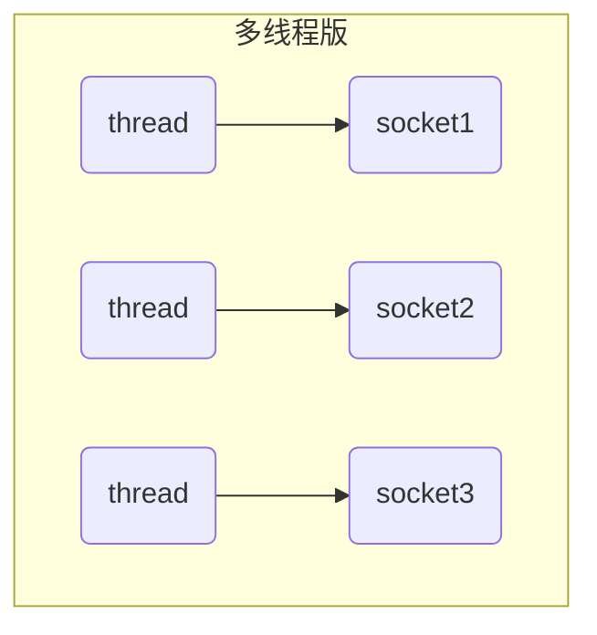
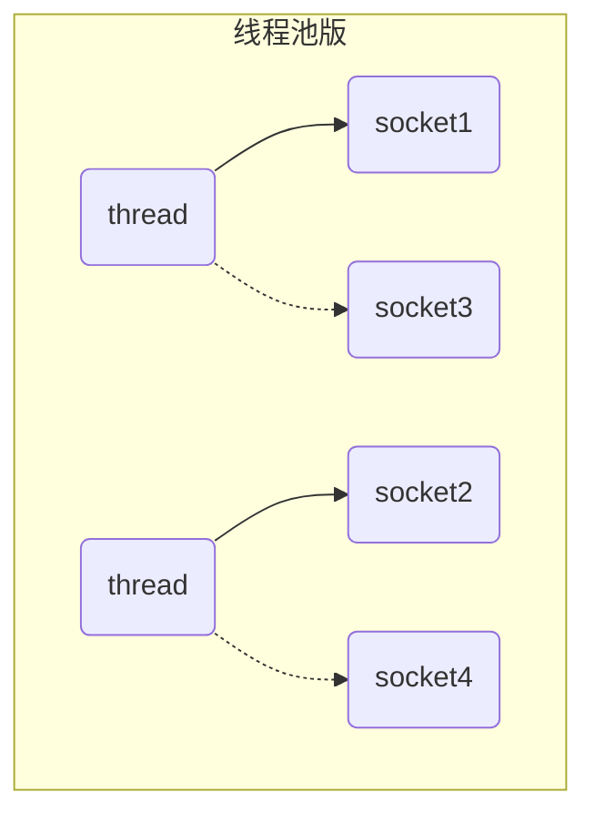
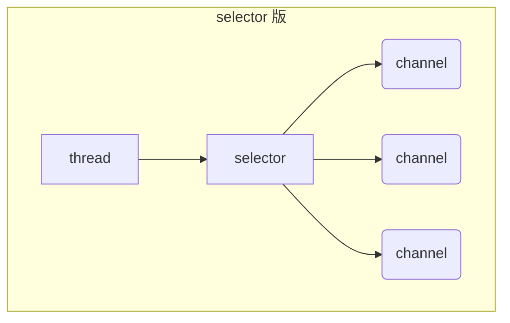

# 三大组件

## Channel & Buffer

NIO 即常说的 non-blocking io，非阻塞 IO（也有人说是 New IO），其包含三大组件：Channel、Buffer 和 Selector。

Channel 类似于 Stream，它是用于读写数据的双向通道，我们可以从 Channel 中将数据读入 Buffer，也可以将缓存在 Buffer 中的数据写入 Channel。和 Steam 有所不同的是，Java 中的 Stream 往往是单向通道，即一个流要么是输入流要么是输出流，而 Channel 则是双向通道，且其相比 Stream 更为底层。常见的 Channel 有：
- FileChannel：用作文件数据传输的通道
- DatagramChannel：做 UDP 网络编程时的数据传输通道
- SocketChannel：做 TCP 数据传输的通道，客户端和服务端都能用
- ServerSocketChannel：做 TCP 数据传输的通道，专用于服务器

Buffer 则用来缓冲读写数据，常见的 Buffer 有：
- ByteBuffer：以字节为单位来缓冲数据，其是一个抽象类，常见实现类包括：
    - MappedByteBuffer
    - DirectByteBuffer
    - HeapByteBuffer
- ShortBuffer
- IntBuffer
- LongBuffer
- FloatBuffer
- DubleBuffer
- CharBuffer

从上述名称可以推断出来，不同类型的 Buffer 用与支持不同类型的数据的缓冲，但后面几种用得较少，使用得最多的还是 ByteBuffer 和它的实现类。

## Selector

Selector 单从字面意思不好理解，需要结合服务器的设计演变过程来理解它的用途。首先，作为一个服务器，必然是需要处理多个客户端的连接的，而如何达到处理多客户端连接的目的，服务器的设计思路是一步步演变的，他们经过的设计阶段有：多线程版本 BIO、线程池版本 BIO 和 NIO。

多线程版本 BIO 的设计思路为：对于每个客户端的 socket 连接，都创建一个新的线程去处理对应的实现，客户端未发送数据且不释放时，对应的线程会阻塞住，即 BIO，对应的设计思路图如下图所示。但由于线程本身会占用一定的内存资源，因此若客户端数量剧增将导致大量的内存占用和线程上下文切换，故只适合连接数较少的情况。

多线程版本由于与 socket 对应的处理线程数量过多从而产生问题，因此服务器的设计进一步演变为线程池版本 BIO，其设计思路为：使用一个线程池维护处理线程以避免线程数量溢出，同时让每个线程在处理完一个连接的请求后可以继续处理其他连接，对应的设计思路图如下图所示。在该种设计思路下，虽然引入了线程池避免了线程数量溢出，但本质上还是采用基于 BIO 的一个线程对应一个 socket 的模式，同一个时间内一个线程只能处理一个 socket，当 socket 未释放时，对应的处理线程会一直阻塞住，并无法去处理其他 socket 请求，故该种模式下适合短连接的场景，故早期的很多服务器都设计为短连接的模式，采用阻塞式 IO。

由于 BIO 一响应一应答模型的局限性，进一步出现了 NIO 模型，其引入了 Selector 来管理多个 Channel，获取在各个 Channel 上发生的时间，这些 Channel 工作在非阻塞模式下，使得处理线程不至于吊死在一个 Channel 上，适合连接数特别多但流量低的场景，其设计思路图如下图所示。当调用 Selector 的 select 方法，就会阻塞知道某个 Channel 发生了读写就绪事件，当事件发生后，select 方法就会返回这些事件并交给 thread 来处理

# 参考文献

- [黑马程序员 Netty 全套教程](https://www.bilibili.com/video/BV1py4y1E7oA)