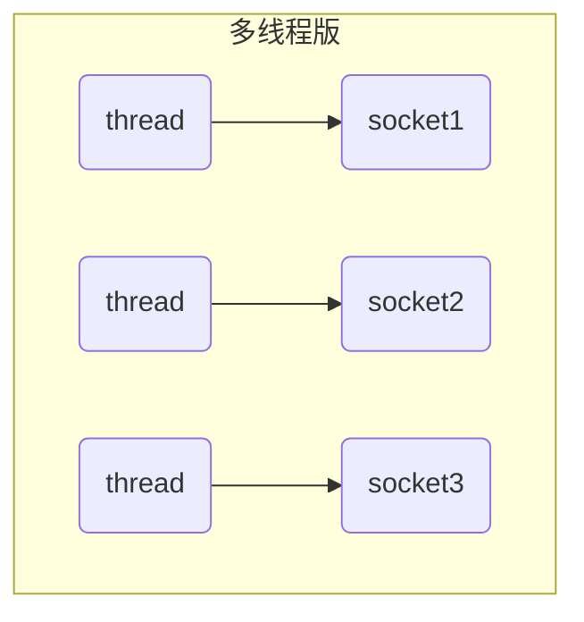
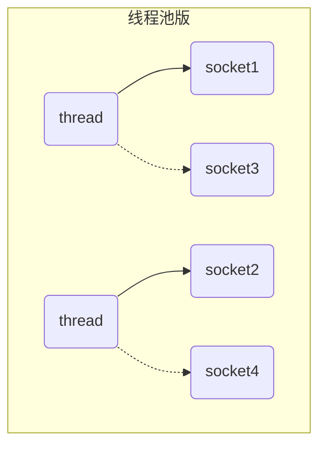
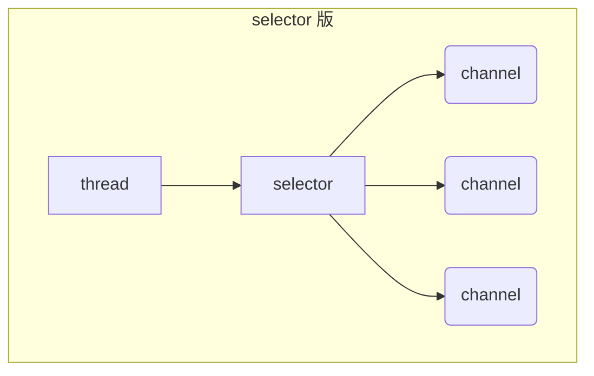

# 1 三大组件

## 1.1 Channel & Buffer

NIO 即常说的 non-blocking io，非阻塞 IO（也有人说是 New IO），其包含三大组件：Channel、Buffer 和 Selector。

Channel 类似于 Stream，它是用于读写数据的双向通道，我们可以从 Channel 中将数据读入 Buffer，也可以将缓存在 Buffer 中的数据写入 Channel。和 Steam 有所不同的是，Java 中的 Stream 往往是单向通道，即一个流要么是输入流要么是输出流，而 Channel 则是双向通道，且其相比 Stream 更为底层。常见的 Channel 有：
- FileChannel：用作文件数据传输的通道
- DatagramChannel：做 UDP 网络编程时的数据传输通道
- SocketChannel：做 TCP 数据传输的通道，客户端和服务端都能用
- ServerSocketChannel：做 TCP 数据传输的通道，专用于服务器

Buffer 则用来缓冲读写数据，常见的 Buffer 有：
- ByteBuffer：以字节为单位来缓冲数据，最常用的缓冲类，其是一个抽象类，常见实现类包括：
    - MappedByteBuffer
    - DirectByteBuffer
    - HeapByteBuffer
- ShortBuffer
- IntBuffer
- LongBuffer
- FloatBuffer
- DubleBuffer
- CharBuffer

从上述名称可以推断出来，不同类型的 Buffer 用与支持不同类型的数据的缓冲，但后面几种用得较少，使用得最多的还是 ByteBuffer 和它的实现类。


## 1.2 Selector

Selector 单从字面意思不好理解，需要结合服务器的设计演变过程来理解它的用途。

首先，作为一个服务器，必然是需要处理多个客户端的连接的，而如何达到处理多客户端连接的目的，服务器的设计思路是一步步演变的，他们经过的设计阶段有：多线程版本 BIO、线程池版本 BIO 和 NIO。

多线程版本 BIO 的设计思路为：对于每个客户端的 socket 连接，都创建一个新的线程去处理对应的实现，客户端未发送数据且不释放时，对应的线程会阻塞住，即 BIO，对应的设计思路图如下图所示。但由于线程本身会占用一定的内存资源（比如 Windows 上默认一个线程占用 1M 内存），因此若客户端数量剧增将导致大量的内存占用和线程上下文切换，故只适合连接数较少的情况。


多线程版本服务器的缺点：
- 内存占用高
- 线程上下文切换成本高
- 只适合连接数少的情况

多线程版本由于与 socket 对应的处理线程数量过多从而产生问题，因此服务器的设计进一步演变为线程池版本 BIO，其设计思路为：使用一个线程池维护处理线程以避免线程数量溢出，同时让每个线程在处理完一个连接的请求后可以继续处理其他连接，对应的设计思路图如下图所示。在该种设计思路下，虽然引入了线程池避免了线程数量溢出，但本质上还是采用基于 BIO 的一个线程对应一个 socket 的模式，同一个时间内一个线程只能处理一个 socket，当 socket 未释放时，对应的处理线程会一直阻塞住，并无法去处理其他 socket 请求，故该种模式下适合短连接的场景，故早期的很多服务器都设计为短连接的模式，采用阻塞式 IO。


线程池版本服务器的缺点：
- 阻塞模式下，线程仅能处理一个 socket 连接
- 仅适合短连接场景：很多早期的服务器为了避免阻塞，都设计为短连接的版本，发送完请求则立即关闭连接，例如早期的 Tomcat 就是这样设计的

由于 BIO 一响应一应答模型的局限性，进一步出现了 NIO 模型，其引入了 Selector 来管理多个 Channel，获取并监听在各个 Channel 上发生的事件，这些 Channel 工作在非阻塞模式下，使得处理线程不至于吊死在一个 Channel 上，适合连接数特别多但流量低的场景，其设计思路图如下图所示：


当程序调用 Selector 的 select 方法，就会阻塞直到某个 Channel 发生了读写就绪事件，当事件发生后，select 方法就会返回这些事件并交给 thread 来处理。


# 2 ByteBuffer

## 2.1 入门案例

我们使用入门案例来讲解 ByteBuffer 的使用。

首先，为了方便后续的开发，提前在 maven 中引入 netty 以及其他基本相关依赖：
```xml
<dependency>
  <groupId>io.netty</groupId>
  <artifactId>netty-all</artifactId>
  <version>4.1.77.Final</version>
</dependency>
<dependency>
  <groupId>org.projectlombok</groupId>
  <artifactId>lombok</artifactId>
  <version>1.18.22</version>
</dependency>
<dependency>
  <groupId>com.google.code.gson</groupId>
  <artifactId>gson</artifactId>
  <version>2.8.6</version>
</dependency>
<dependency>
  <groupId>com.google.guava</groupId>
  <artifactId>guava</artifactId>
  <version>31.0.1-jre</version>
</dependency>
<dependency>
  <groupId>ch.qos.logback</groupId>
  <artifactId>logback-classic</artifactId>
  <version>1.2.4</version>
</dependency>
```

我们创建一个 date.txt 文件，其内容为 `1234567890abc`，之后我们使用 nio 从文件中读取内容，首先构建该文件对应的 FileChannel，然后从 FileChannel 中读取文件到 ByteBuffer 中，最后将 ByteBuffer 转化为字符并打印，具体 demo 如下所示：
```java
import java.io.FileInputStream;
import java.io.IOException;
import java.nio.ByteBuffer;
import java.nio.channels.FileChannel;
import lombok.extern.slf4j.Slf4j;

/**
 * NIO 入门 demo，以 ByteBuffer 为例子读取 data.txt 数据并打印；
 * data.txt 内容：1234567890abc
 */
@Slf4j
public class ByteBufferTest {

    /**
     * ByteBuffer 的使用步骤一般如下：
     * 1. 读取通道数据并写入到 buffer，例如调用 channel.read(buffer)
     * 2. 调用将 buffer.flip() 将 buffer 切换到读模式
     * 3. 从 buffer 读取数据，例如 buffer.get() 为读取一个字节
     * 4. 调用 buffer.clear() 或 buffer.compact() 将 buffer 切换回写模式，让 channel 继续往里写数据
     * 5. 重复 1~4 步骤
     * @param args
     */
    public static void main(String[] args) {

        // 使用 FileChannel 读取文件，获取 FileChannel 有两种方式：
        // 1. 可以使用输入输出流（InputStream，OutputStream）获取为 FileChannel
        // 2. 可以使用 RandomAccessFile 来获取 FileChannel

        // 使用 java7 提供的 try with 语法释放资源
        try (FileChannel channel = new FileInputStream("data.txt").getChannel()) {
            // 对于 NIO，要读取数据需要先准备缓冲区，我们使用 ByteBuffer.allocate 分配缓冲区
            ByteBuffer byteBuffer = ByteBuffer.allocate(10); // 分配 10 Byte 的缓冲区

            while (true) {
                // 从 channel 读取数据并暂存到缓冲区 Buffer 中
                int len = channel.read(byteBuffer);
                if (len == -1) {
                    // EOF，读到文件尾，结束读取
                    break;
                }
                log.debug("read {} bytes...", len);

                // 逐字节打印 buffer 的内容
                byteBuffer.flip(); // 切换到 buffer 的读模式
                // 循环 buffer 逐字节读取数据
                while (byteBuffer.hasRemaining()) {
                    byte b = byteBuffer.get(); // 无参 get，一次读一个 byte
                    System.out.println((char) b); // 对于 ASCII 内的字符，可直接强转并打印
                }
                // 将 buffer 切换回写模式
                byteBuffer.clear();
            }


        } catch (IOException e) {

        }
    }
}

```

## 2.2 ByteBuffer 使用步骤

我们一般会按照下列步骤使用 ByteBuffer：
-  从 channel 向 buffer 写入数据，例如调用 channel.read(buffer)
-  调用 flip() 将 buffer 切换至读模式
-  从 buffer 读取数据，例如调用 buffer.get()
-  调用 clear() 或 compact() 将 buffer 切换至写模式，准备进行下一轮的文件数据读取
-  重复 1~4 步骤


## 2.3 ByteBuffer 结构

### 2.3.1 ByteBuffer 结构分析

ByteBuffer 本质上就是一个定长 byte 数组用作缓存，其主要有三个重要属性：
- capacity：容量，即创建 ByteBuffer 时声明的数组长度
- position：当前指针的下标，ByteBuffer 有读模式和写模式，每种模式有各自维护的 position
- limit：写入限制，初始为 capacity

刚创建 ByteBuffer 的初始状态如下图所示，其默认位于写模式，写模式下的 position 表示写入位置，故此时 `position = 0` 表示从下标 0 出开始往后逐字节写入，同时写入限制 limit 会初始化为 capacity。


在写模式下对 ByteBuffer 执行写入后，就会从写模式的 position 开始往后逐字节写入，下图为写入了 4 个字节后的状态：


假设写入完毕，之后要进行读取，当执行 `byteBuffer.flip()` 方法后，就会将 byteBuffer 转化为读模式，其会设置 `limit = position, position = 0`，转变为读模式后 ByteBuffer 的状态如下图所示：


转换为读模式后，之后便会从 `position = 0` 处开始往后读取，读取 4 个字节完毕后， ByteBuffer 的状态如下图所示：


已经读取完毕，后续可能需要继续下一轮的写入，则可以通过调用 `byteBuffer.clear()` 方法转化为写模式，其会设置 `position = 0, limit = capacity;`，即相当于会到初始状态，其状态如下图所示：


要从读模式转化为写模式，可以使用 clear() 或 compact() 方法，但不管是模式哪个方法，在转换模式时都是令 position 重新为 0 往后工作的，其中 clear 会忽视缓冲区中未读内容，直接设置 `position = 0` 后就从 0 出开始往后写入，而 compact 将当前缓冲区的未读内容从 `position = 0` 开始往后写入，然后才继续写我们的即将写入的内容；基于这两种情况，再将写模式转换为读模式后，都应该直接从 `position = 0` 处开始读取的，这也是 flip() 方法中会直接将 position 设置为 0 的原因。因此，记住一点，只要进行模式转换，必定将 position 设置为 0，其中 compact 特殊一点，但也可以看成设置为 0 后从 0 开始写入上次未读完的内容，而 clear 则相当于直接忽略未读完的内容。

### 2.3.2 ByteBuffer 调试工具类

下面的工具类可以很方便地打印 ByteBuffer 当前的缓存内容，便于学习调试：
```java
import static io.netty.util.internal.MathUtil.isOutOfBounds;
import static io.netty.util.internal.StringUtil.NEWLINE;

import io.netty.util.internal.StringUtil;
import java.nio.ByteBuffer;

public class ByteBufferUtil {
    private static final char[] BYTE2CHAR = new char[256];
    private static final char[] HEXDUMP_TABLE = new char[256 * 4];
    private static final String[] HEXPADDING = new String[16];
    private static final String[] HEXDUMP_ROWPREFIXES = new String[65536 >>> 4];
    private static final String[] BYTE2HEX = new String[256];
    private static final String[] BYTEPADDING = new String[16];

    static {
        final char[] DIGITS = "0123456789abcdef".toCharArray();
        for (int i = 0; i < 256; i++) {
            HEXDUMP_TABLE[i << 1] = DIGITS[i >>> 4 & 0x0F];
            HEXDUMP_TABLE[(i << 1) + 1] = DIGITS[i & 0x0F];
        }

        int i;

        // Generate the lookup table for hex dump paddings
        for (i = 0; i < HEXPADDING.length; i++) {
            int padding = HEXPADDING.length - i;
            StringBuilder buf = new StringBuilder(padding * 3);
            for (int j = 0; j < padding; j++) {
                buf.append("   ");
            }
            HEXPADDING[i] = buf.toString();
        }

        // Generate the lookup table for the start-offset header in each row (up to 64KiB).
        for (i = 0; i < HEXDUMP_ROWPREFIXES.length; i++) {
            StringBuilder buf = new StringBuilder(12);
            buf.append(NEWLINE);
            buf.append(Long.toHexString(i << 4 & 0xFFFFFFFFL | 0x100000000L));
            buf.setCharAt(buf.length() - 9, '|');
            buf.append('|');
            HEXDUMP_ROWPREFIXES[i] = buf.toString();
        }

        // Generate the lookup table for byte-to-hex-dump conversion
        for (i = 0; i < BYTE2HEX.length; i++) {
            BYTE2HEX[i] = ' ' + StringUtil.byteToHexStringPadded(i);
        }

        // Generate the lookup table for byte dump paddings
        for (i = 0; i < BYTEPADDING.length; i++) {
            int padding = BYTEPADDING.length - i;
            StringBuilder buf = new StringBuilder(padding);
            for (int j = 0; j < padding; j++) {
                buf.append(' ');
            }
            BYTEPADDING[i] = buf.toString();
        }

        // Generate the lookup table for byte-to-char conversion
        for (i = 0; i < BYTE2CHAR.length; i++) {
            if (i <= 0x1f || i >= 0x7f) {
                BYTE2CHAR[i] = '.';
            } else {
                BYTE2CHAR[i] = (char) i;
            }
        }
    }

    /**
     * 打印所有内容
     * @param buffer
     */
    public static void debugAll(ByteBuffer buffer) {
        int oldlimit = buffer.limit();
        buffer.limit(buffer.capacity());
        StringBuilder origin = new StringBuilder(256);
        appendPrettyHexDump(origin, buffer, 0, buffer.capacity());
        System.out.println("+--------+-------------------- all ------------------------+----------------+");
        System.out.printf("position: [%d], limit: [%d]\n", buffer.position(), oldlimit);
        System.out.println(origin);
        buffer.limit(oldlimit);
    }

    /**
     * 打印可读取内容
     * @param buffer
     */
    public static void debugRead(ByteBuffer buffer) {
        StringBuilder builder = new StringBuilder(256);
        appendPrettyHexDump(builder, buffer, buffer.position(), buffer.limit() - buffer.position());
        System.out.println("+--------+-------------------- read -----------------------+----------------+");
        System.out.printf("position: [%d], limit: [%d]\n", buffer.position(), buffer.limit());
        System.out.println(builder);
    }

    private static void appendPrettyHexDump(StringBuilder dump, ByteBuffer buf, int offset, int length) {
        if (isOutOfBounds(offset, length, buf.capacity())) {
            throw new IndexOutOfBoundsException(
                "expected: " + "0 <= offset(" + offset + ") <= offset + length(" + length
                    + ") <= " + "buf.capacity(" + buf.capacity() + ')');
        }
        if (length == 0) {
            return;
        }
        dump.append(
            "         +-------------------------------------------------+" +
                NEWLINE + "         |  0  1  2  3  4  5  6  7  8  9  a  b  c  d  e  f |" +
                NEWLINE + "+--------+-------------------------------------------------+----------------+");

        final int startIndex = offset;
        final int fullRows = length >>> 4;
        final int remainder = length & 0xF;

        // Dump the rows which have 16 bytes.
        for (int row = 0; row < fullRows; row++) {
            int rowStartIndex = (row << 4) + startIndex;

            // Per-row prefix.
            appendHexDumpRowPrefix(dump, row, rowStartIndex);

            // Hex dump
            int rowEndIndex = rowStartIndex + 16;
            for (int j = rowStartIndex; j < rowEndIndex; j++) {
                dump.append(BYTE2HEX[getUnsignedByte(buf, j)]);
            }
            dump.append(" |");

            // ASCII dump
            for (int j = rowStartIndex; j < rowEndIndex; j++) {
                dump.append(BYTE2CHAR[getUnsignedByte(buf, j)]);
            }
            dump.append('|');
        }

        // Dump the last row which has less than 16 bytes.
        if (remainder != 0) {
            int rowStartIndex = (fullRows << 4) + startIndex;
            appendHexDumpRowPrefix(dump, fullRows, rowStartIndex);

            // Hex dump
            int rowEndIndex = rowStartIndex + remainder;
            for (int j = rowStartIndex; j < rowEndIndex; j++) {
                dump.append(BYTE2HEX[getUnsignedByte(buf, j)]);
            }
            dump.append(HEXPADDING[remainder]);
            dump.append(" |");

            // Ascii dump
            for (int j = rowStartIndex; j < rowEndIndex; j++) {
                dump.append(BYTE2CHAR[getUnsignedByte(buf, j)]);
            }
            dump.append(BYTEPADDING[remainder]);
            dump.append('|');
        }

        dump.append(NEWLINE +
            "+--------+-------------------------------------------------+----------------+");
    }

    private static void appendHexDumpRowPrefix(StringBuilder dump, int row, int rowStartIndex) {
        if (row < HEXDUMP_ROWPREFIXES.length) {
            dump.append(HEXDUMP_ROWPREFIXES[row]);
        } else {
            dump.append(NEWLINE);
            dump.append(Long.toHexString(rowStartIndex & 0xFFFFFFFFL | 0x100000000L));
            dump.setCharAt(dump.length() - 9, '|');
            dump.append('|');
        }
    }

    public static short getUnsignedByte(ByteBuffer buffer, int index) {
        return (short) (buffer.get(index) & 0xFF);
    }
}
```

### 2.3.3 ByteBuffer 结构简单验证

下面的代码对 ByteBuffer 的结构做了简单的验证，首先
```java
@Slf4j
public class ByteBufferTest {

    public static void main(String[] args) {

        // 分配 16 字节的缓冲
        ByteBuffer byteBuffer = ByteBuffer.allocate(10);

        // 默认为写模式，写入 a b c d e 的 ASCII
        for (int i = 0; i < 5; i++) {
            byteBuffer.put((byte) (0x61 + i));
        }
        // 调用工具查看缓冲区
        debugAll(byteBuffer);

        // 读写模式有自己的 position
        // 若不切换为读模式，从当前写模式的 position=5 处开始读，会读到 0，同时会导致下次写入跳过该位置
        System.out.println("read position = 5: " + byteBuffer.get()); // 读到 0

        // 继续写入，会跳过 position=6 位置，即 f 被写入 position=6 的位置
        byteBuffer.put((byte) (byte) 'f');
        debugAll(byteBuffer);

        // 切换为读模式，position 变为 0 并往后开始读取
        byteBuffer.flip();
        System.out.println("read position = 0: " + byteBuffer.get());
        System.out.println("read position = 1: " + byteBuffer.get());
        System.out.println("read position = 2: " + byteBuffer.get());

        // 之后打印缓冲区剩余内容
        debugAll(byteBuffer);
    }
}

// 上述代码打印下述结果：
+--------+-------------------- all ------------------------+----------------+
position: [5], limit: [10]
         +-------------------------------------------------+
         |  0  1  2  3  4  5  6  7  8  9  a  b  c  d  e  f |
+--------+-------------------------------------------------+----------------+
|00000000| 61 62 63 64 65 00 00 00 00 00                   |abcde.....      |
+--------+-------------------------------------------------+----------------+
read position = 5: 0
+--------+-------------------- all ------------------------+----------------+
position: [7], limit: [10]
         +-------------------------------------------------+
         |  0  1  2  3  4  5  6  7  8  9  a  b  c  d  e  f |
+--------+-------------------------------------------------+----------------+
|00000000| 61 62 63 64 65 00 66 00 00 00                   |abcde.f...      |
+--------+-------------------------------------------------+----------------+
read position = 0: 97
read position = 1: 98
read position = 2: 99
+--------+-------------------- all ------------------------+----------------+
position: [3], limit: [7]
         +-------------------------------------------------+
         |  0  1  2  3  4  5  6  7  8  9  a  b  c  d  e  f |
+--------+-------------------------------------------------+----------------+
|00000000| 61 62 63 64 65 00 66 00 00 00                   |abcde.f...      |
+--------+-------------------------------------------------+----------------+
```

## 2.4 ByteBuffer 常用方法

### 2.4.1 分配空间

使用 `ByteBuffer.allocation(int)` 分配空间，其会返回一个 byteBuffer 实例
```java
ByteBuffer buf = ByteBuffer.allocate(16);
```

### 2.4.2 向 ByteBuffer 实例写入数据

向 ByteBuffer 实例写入数据有两种方法：
- 调用 channel 的 read(byteBuffer) 方法，其会从 channel 读取数据并写入到 byteBuffer
- 调用 byteBuffer 自身的 put 方法直接写入数据
```java
// 从 channel 中读取并写入 buf
int readBytes = channel.read(buf);

// 调用 bf 自身的 put 方法
buf.put((byte) 127);
```

### 2.4.3 从 ByteBuffer 实例读取数据

从 ByteBuffer 实例读取数据同样有两种方法：
- 调用 channel 的 write 方法会从 byteBuffer 读取数据并写入到 channel 中
- 直接调用 byteBuffer.get() 或 byteBuffer.get(i) 方法从 byteBuffer 读取数据
```java
// 从 buf 读取数据并写入到 channel 中
int writeBytes = channel.write(buf);

// 直接调用 bf 自身的 get 方法读取数据
byte b = buf.get();
byte c = buf.get(0);
```

其中 get() 方法会让 position 指针往后移动，如果想重复读取数据，可以：
- 调用 rewind 方法将 position 重置为 0，从头读取
- 调用 get(int i) 方法可以直接获取指定位置 i 的内容，它不会移动 position 指针

下面是对 put, get 和 rewind 方法的简单测试：
```java
public class ByteBufferTest {

    // 连续读取两个字符并打印在一行
    private static void printTwoCharacter(ByteBuffer buffer) {
        System.out.print((char)buffer.get());
        System.out.print((char)buffer.get());
        System.out.println();
    }

    public static void main(String[] args) {
        ByteBuffer buffer = ByteBuffer.allocate(10);
        buffer.put(new byte[]{'a', 'b', 'c', 'd'});

        // 切换到读模式
        buffer.flip();

        // 读取 ab
        printTwoCharacter(buffer);
        // 读取 cd
        printTwoCharacter(buffer);

        // 将 position 重置为 0
        buffer.rewind();

        // 读取 ab
        printTwoCharacter(buffer);

        // get(i) 不会改变 position 指针，直接读取指定位置的内容
        // 读取 ac
        System.out.print((char)buffer.get(0));
        System.out.print((char)buffer.get(2));
    }
}
```

### 2.4.4 mark 和 reset


mark() 可以在当前 position 指针所在位置添加一个标记，当调用 reset 方法时则

下面是对 mark 和 reset 的简单测试代码：
```java
public class ByteBufferTest {

    // 连续读取两个字符并打印在一行
    private static void printTwoCharacter(ByteBuffer buffer) {
        System.out.print((char)buffer.get());
        System.out.print((char)buffer.get());
        System.out.println();
    }

    public static void main(String[] args) {
        ByteBuffer buffer = ByteBuffer.allocate(10);
        buffer.put(new byte[]{'a', 'b', 'c', 'd'});

        // 切换到读模式
        buffer.flip();

        // 读取 ab
        printTwoCharacter(buffer);
        
        // 使用 mark 标记 position = 2 的位置
        buffer.mark();

        // 读取 cd
        printTwoCharacter(buffer);

        // 使用 reset 将 position 设置为上次标记的位置，此处 = 2
        buffer.reset();
        printTwoCharacter(buffer);

        // 再次使用 reset 将 position 设置为上次标记的位置，此处 = 2
        buffer.reset();
        printTwoCharacter(buffer);
    }
}
```

### 2.4.5 字符串与 ByteBuffer 互转

我们知道 ByteBuffer 存储的本质就是字节数组，因此字符串和 ByteBuffer 的互转就是基于字符串的字节数组来实现的。

从字符串转化为 ByteBuffer 本质上就是需要获取字符串在某一编码下的字节数组，然后将字节数组写入到 ByteBuffer 中，常见有下列三种写法：
- 原始方式：自己创建合适长度的 ByteBuffer 实例并存储字符串指定编码的字节数组
- 使用 Charset.encode 方法：Charset 是由 nio 定义的一个抽象编码类，并提供常见的字符编码的匿名实现实例，使用指定实现类的 encode 方法便可以直接获取对应的 ByteBuffer，同时启会自动切换为读模式
- 使用 ByteBuffer.wrap(byte[]) 方法：也可以在获取字符串某一编码的字节数组后，直接使用 wrap 包装为 ByteBuffer，该方法同样会自动转换为读模式

而从 ByteBuffer 转换为字符串，本质上就是从 ByteBuffer 中读取到字节数组，并按指定编码解码为字符串即可，常见有两种写法：
- 原始方式：仍然自己手动从 byteBuffer 读到字节数组，然后以指定字节数组和字符编码的方式创建字符串即可
- 使用 Charset.decode 方法：可以直接使用指定字符编码对应的 Charset 实例的 decode 方法，从 ByteBuffer 中获得转换，其得到的是一个 CharBuffer，调用 toString 即可获得字符串

下列代码测试了字符串与 ByteBuffer 的互转，主要基于 UTF-8 编码进行：
```java
public class ByteBufferTest {

    public static void main(String[] args) {
        String s = "hello世界";

        System.out.println("--------------字符串转化为 ByteBuffer------------");
        // 方式一：采用原始方式，直接获取字符串的 bytes，并自己创建 byteBuffer 进行读写
        // 该种方式不会自动切换为读模式，因为是我们自己手动创建的 byteBuffer，因此要读取并转换回字符串要调用 flip()
        ByteBuffer simpleBuffer = ByteBuffer.allocate(11);
        simpleBuffer.put(s.getBytes(StandardCharsets.UTF_8));
        debugAll(simpleBuffer);
        
        // 方式二：使用 nio 提供的 Charset.encode(String) 方法
        // Charset 为抽象字符类，有不同的子实现类，每一种实现类都对应一种编码
        // 该种方式会在内部创建并返回 ByteBuffer，同时会自动切换为读模式
        ByteBuffer encodeBuffer = StandardCharsets.UTF_8.encode(s);
        debugAll(encodeBuffer);

        // 方式三：使用 wrap 包装字节数组
        // 同样该种方式会在内部创建并返回 ByteBuffer，同时会自动切换为读模式
        ByteBuffer wrapBuffer = ByteBuffer.wrap(s.getBytes(StandardCharsets.UTF_8));
        debugAll(wrapBuffer);

        System.out.println("--------------ByteBuffer 转化为字符串------------");
        // 方式一：手动处理，自己从 byteBuffer 读出字节数组并转化为字符串
        // 采用 get(i) 的读取方式，不依赖读模式，不影响 position
        byte[] bytes = new byte[simpleBuffer.position()];
        for (int i = 0; i < bytes.length; i++) {
            bytes[i] = simpleBuffer.get(i);
        }
        System.out.println(new String(bytes, StandardCharsets.UTF_8));

        // 方式二：使用 Charset.decode() 方法
        // 对于自己创建的 byteBuffer，必须先转化为读模式，才可以成功读取并转化为字符串
        simpleBuffer.flip();
        System.out.println(StandardCharsets.UTF_8.decode(simpleBuffer));
        System.out.println(StandardCharsets.UTF_8.decode(encodeBuffer));
        System.out.println(StandardCharsets.UTF_8.decode(wrapBuffer));
    }
}
```

## 2.5 分散读取 Scattering Reads

假设有一段文本 parts.txt，其内容如下，我们需要分别读取出三个单词，则可以采用分散读取的功能
```text
onetwothree
```

分散读取时可以提供一个 ByteBuffer 数组，其会逐步从前往后填满 ByteBuffer，因此我们提供一个长度为 3 的 ByteBuffer 数组，各个 ByteBuffer 的长度分别为 3、3、5 即可成功分散读取，示例代码如下：
```java
public class ByteBufferTest {
    // parts.txt 内容为：onetwothree
    public static void main(String[] args) {
        try (RandomAccessFile file = new RandomAccessFile("parts.txt", "rw")) {
            FileChannel channel = file.getChannel();

            ByteBuffer b1 = ByteBuffer.allocate(3);
            ByteBuffer b2 = ByteBuffer.allocate(3);
            ByteBuffer b3 = ByteBuffer.allocate(5);

            // 使用分散读取，会自动填满 b1, b2, b3
            channel.read(new ByteBuffer[]{b1, b2, b3});

            // 切换为读模式后打印内容
            b1.flip();
            b2.flip();
            b3.flip();
            System.out.println(StandardCharsets.UTF_8.decode(b1));
            System.out.println(StandardCharsets.UTF_8.decode(b2));
            System.out.println(StandardCharsets.UTF_8.decode(b3));
        } catch (IOException e) {

        }
    }
}
```

## 2.6 聚合写入 Gathering Writes

假设现在有三个 ByteBuffer，现在想将这三个 ByteBuffer 写入到一个文件，主要有两种思路：
- 可以对通道调用三次写入方法，但这样存在多次 IO，效率较低
- 还可以采用聚合写入的方式，直接提供一个长度为 3 的 ByteBuffer 数组，Channel 会自动按序合并多个 ByteBuffer 为一个并执行写入，该种方式只会触发一次 IO

下面为聚合写入的简单测试代码，即以聚合写入的方式将字符串 `hello, world!` 写入到文件：
```java
public class ByteBufferTest {
    public static void main(String[] args) {
        try (FileOutputStream file = new FileOutputStream("data.txt")) {
            FileChannel channel = file.getChannel();

            ByteBuffer b1 = ByteBuffer.wrap("hello".getBytes());
            ByteBuffer b2 = ByteBuffer.wrap(", ".getBytes());
            ByteBuffer b3 = ByteBuffer.wrap("world!".getBytes());

            channel.write(new ByteBuffer[]{b1, b2, b3});
        } catch (IOException e) {

        }
    }
}
```

## 2.7 综合练习：粘包半包解析

网络上有多条数据发送给服务端，数据之间使用 `\n` 进行分隔，但由于某种原因这些数据在接收时，被进行了重新组合，例如原始数据有 3 条为：
- Hello,world\n
- I'm zhangsan\n
- How are you?\n

但由于网络传输中黏包和半包的原因，变成了下面的两个 byteBuffer (黏包，半包)
- Hello,world\nI'm zhangsan\nHo
- w are you?\n

现在要求你编写程序，将错乱的数据恢复成原始的按 `\n` 分隔的数据

针对上述需求，实现代码如下：
```java
public class ByteBufferTest {

    public static void main(String[] args) {
        ByteBuffer source = ByteBuffer.allocate(32);
        source.put("Hello,world\nI'm zhangsan\nHo".getBytes());
        split(source);

        // 注意最后如果不加 \n 分割符，最后一个会被当做还没传输完毕不打印
        source.put("w are you?\nhaha!\n".getBytes());
        split(source);
    }

    // 不消耗的形式进行打印字符，只支持 ASCII
    private static void print(ByteBuffer byteBuffer) {
        byteBuffer.flip();

        // 切换到读模式拿到 limit，确定可打印部分为 [0, limit)
        int limit = byteBuffer.limit();
        for (int i = 0; i < limit; i++) {
            System.out.print((char)byteBuffer.get(i));
        }
        System.out.println();

        // 切换回写模式，不会对原内容有影响，可继续写
        byteBuffer.compact();
    }

    private static void split(ByteBuffer source) {
        // 切换为读模式，进行读取操作
        source.flip();

        // 获取可读的 limit
        int limit = source.limit();

        for (int i = 0; i < limit; i++) {
            // 检测到分割符，则表示当前读模式的 [position, i] 为完整字符串，可以读取并打印
            // 读取完毕后，将 position 变为 i + 1
            if (source.get(i) == '\n') {
                // 我们同样声明一个新的 ByteBuffer 存储这个完整的字符串
                int len = i - source.position() + 1;
                ByteBuffer target = ByteBuffer.allocate(len);
                // 从 source 中读取并写入到 target 中，由于只能读取到分割符处，因此要设置 source 的 limit
                source.limit(i + 1);
                target.put(source);
                // 打印读取到的 target
                print(target);

                // 读取完毕后，要恢复原有 limit
                source.limit(limit);
            }
        }

        // 切换回写模式继续后续写入，注意要使用 compact 因为缓冲区可能还存在不完整的未读取的字节
        source.compact();
    }
}
```


## 2.8 补充

### 2.8.1 ByteBuffer 常见实现类

ByteBuffer 有两个最常见的实现类，分别是 `java.nio.HeapByteBuffer` 和 `java.nio.DirectByteBuffer`。其中 HeapByteBuffer 分配在堆内存上，读写效率较低，会受到 GC 的影响（GC 时会拷贝，变换存储位置等）。而 DirectByteBuffer 分配在直接内存上，读写效率较高（少一次拷贝），且不会受到 GC 影响，但分配的效率较低。
```java
public class ByteBufferTest {
    public static void main(String[] args) {
        System.out.println(ByteBuffer.allocate(16).getClass());
        System.out.println(ByteBuffer.allocateDirect(16).getClass());
    }
}
```

# 3 文件编程

## 3.1 FileChannel

FileChannel 我们前面在读写文件时已经用过，其是用于文件读写的通道。注意 FileChannel 只能工作在阻塞模式下，无法和 Selector 配合完成非阻塞式的 IO，只有我们后面介绍的和网络相关的 SocketChannel，才能和 Selector 配合工作在非阻塞模式下。

如何获取 FileChannel：不能直接打开 FileChannel，而必须通过 FileInputStream、FileOutputStream 或 RandomAccessFile 来获取 FileChannel，它们都有 getFileChannel 方法。此外，FileChannel 虽然是可读可写的，但是根据获取 FileChannel 的源头就已经决定了该 FileChannel 是可读的还是可写的：
- 通过 FileInputStream 获取的 channel 只能读
- 通过 FileOutputStream 获取的 channel 只能写
- 通过 RandomAccessFile 是否能读写由构造 RandomAccessFile 时传入的读写模式决定

### 3.1.1 读取

对于 FileChannel 的读取操作，首先要准备一个写模式的 ByteBuffer，然后从 FileChannel 读取数据并写到 ByteBuffer 中：
```java
int readBytes = channel.read(buffer);
```

### 3.1.2 写入

对于 FileChannel 的写入操作，需要将要写入的数据缓存在一个读模式的 ByteBuffer 中，然后调用 FileChannel 的 write 方法进行写入。
```java
while (buffer.hasRemaining()) {
    channel.write(buffer);
}
```

此外，需要注意的是，上述代码中，我们的写入是写在循环中的。对于 FileChannel，其传输能力没有限制，一次 write 就可以写完毕了，那么可以不需要循环，但是对于后续网络编程的 SockeChannel，其传输数据的能力是有限的，未必能一次性传输完 Buffer 中的所有内容，因此要采用循环写入的方式。

下面是基于 FileChannel 和 ByteBuffer 实现的文件拷贝的函数：
```java
public class ByteBufferTest {
    private static void copy(String from, String to) {
        try (
            FileInputStream fromStream = new FileInputStream(from);
            FileOutputStream toStream = new FileOutputStream(to);
            FileChannel fromChannel = fromStream.getChannel();
            FileChannel toChannel = toStream.getChannel();
        ) {
            final ByteBuffer buffer = ByteBuffer.allocate(20);
            int readBytes;
            while ((readBytes = fromChannel.read(buffer)) != -1) {
                buffer.flip();
                while (buffer.hasRemaining()) {
                    toChannel.write(buffer);
                }
                buffer.compact();
            }
        } catch(IOException e) {
            throw new RuntimeException(e);
        }
    }

    public static void main(String[] args) throws FileNotFoundException {
        copy("data.txt", "data2.txt");
    }
}
```

注意，需要在 while 中循环调用 channel.write()，因为只调用一次 write 方法并不能保证将 buffer 中的全部内容写入到 channel 中。

### 3.1.3 关闭

Channel 必须关闭，但调用了 FileInputStream、FileOutputStream 和 RandomAccessFile 的 close 方法会间接地调用 channel 的 close 方法

### 3.1.4 位置

FileChannel 内部也维护了一个 position，表示当前读取到文件位置。

可以使用 position() 方法获取和设置文件通道的当前位置，示例代码如下：
```java
// 获取 position 位置
long pos = channel.position()

// 设置 position 位置
channel.position(val);
```

需要注意，设置 position 时，如果设置为文件的末尾，此时读取会返回 -1，且继续写入会以追加的形式将内容追加到文件尾，但如果设置的 position 的值超过了文件末尾，写入时在新内容和原末尾之间会多出多余的 0。

### 3.1.5 大小

使用 size() 方法获取文件的大小

### 3.1.6 强制写入

操作系统出于性能的考虑，会将数据缓存，不是立刻写入磁盘，可以调用 `force(true)` 方法将文件内容和元数据（文件的权限等信息）立刻写入磁盘。


## 3.2 两个 Channel 传输数据

两个 Channel 之间可以直接使用 `transferTo(源通道拷贝起始位置， 拷贝大小， 目标通道)` 方法传输数据并返回实际传输字节数，且该方法比我们自己读写文件效率更高，因为操作系统底层会利用零拷贝技术进行优化

例如，下述代码实现了文件的拷贝，相比前面我们自己创建 buffer 进行拷贝更加地简洁：
```java
public class ByteBufferTest {
    private static void copy(String from, String to) {
        try (
            FileChannel fromChannel = new FileInputStream(from).getChannel();
            FileChannel toChannel = new FileOutputStream(to).getChannel();
        ) {
            fromChannel.transferTo(0, fromChannel.size(), toChannel);
        } catch(IOException e) {
            throw new RuntimeException(e);
        }
    }
    public static void main(String[] args) throws FileNotFoundException {
        copy("data.txt", "data3.txt");
    }
}
```

需要特别注意，transferTo 方法单次传输有上限，上限为 2G，因此上述代码对于超过 2G 的文件拷贝存在 bug，其只会拷贝前 2G 的文件内容，后面的内容不拷贝，因此我们需要进一步改进。改进的方式是利用 position 进行多次传输，改进后的文件拷贝方法如下所示：
```java
private static void copy(String from, String to) {
    try (
        FileChannel fromChannel = new FileInputStream(from).getChannel();
        FileChannel toChannel = new FileOutputStream(to).getChannel();
    ) {
        final long size = fromChannel.size();
        long leftBytes = size;
        while (leftBytes > 0) {
            long transferBytes = fromChannel.transferTo(size - leftBytes, leftBytes, toChannel);
            leftBytes -= transferBytes;
        }
    } catch(IOException e) {
        throw new RuntimeException(e);
    }
}
```

## 3.3 Path 类

jdk7 引入了 Path 和 Paths 类，Path 用来表示文件路径，Paths 是工具类，用来获取 Path 实例。简单用法如下：
```java
// 相对路径，使用 user.dir 来定位 data.txt
Path source = Paths.get("data.txt");

// 绝对路径 C:\tmp\data.txt
Path source = Paths.get("C:\\tmp\\data.txt");

// 绝对路径 C:\tmp\data.txt
Path source = Paths.get("C:/tmp/data.txt");

// 绝对路径 C:\tmp\data.txt
Path source = Paths.get("c:/tmp", "data.txt");
```

其中，对于 Path 的获取时，可以直接使用 `.` 和 `..` 分别表示当前目录和上一级目录，对于这类路径可以使用 normalize() 方法进行正常话，即可以打印出真正的路径，例如下述代码：
```java
Path source = Paths.get("c:/tmp/test/../data.txt");
// 会打印 c:\tmp\test\..\data.txt
System.out.println(source);
// 会打印 c:\tmp\data.txt
System.out.println(source.normalize());
```

## 3.4 Files 类

Files 也是 jdk 1.7 新增的文件工具类，主要配合 Path 使用，提供一些文件的常用方法，例如下列 demo 展示了一些常用的读取文件信息的方法：
```java
public class ByteBufferTest {

    static void say(String id, Object result) {
        System.out.print(id + ": ");
        System.out.println(result);
    }

    // 参考自 On Java 8
    public static void main(String[] args) throws IOException {
        Path path = Paths.get("c:/tmp/test/../data.txt");

        // 判断文件是否存在
        say("Exists", Files.exists(path));
        // 判断文件是否目录
        say("Directory", Files.isDirectory(path));
        // 判断文件是否为可执行文件（Linux 下的 x）
        say("Executable", Files.isExecutable(path));
        // 文件是否可读
        say("Readable", Files.isReadable(path));
        // 判断是否 RegularFile
        // Regular - Stores data (text, binary, and executable).
        // Directory - Contains information used to access other files.
        // Special - FIFO file(also called pipes), symlinks or a physical device.
        say("RegularFile", Files.isRegularFile(path));
        // 判断文件是否可写
        say("Writable", Files.isWritable(path));
        // 文件是否不存在
        say("notExists", Files.notExists(path));
        // 文件是否为隐藏
        say("Hidden", Files.isHidden(path));
        // 返回文件的字节数
        say("size", Files.size(path));
        // 获取磁盘的根目录（Linux 下的挂载点，Win 下的盘符）
        say("FileStore", Files.getFileStore(path));
        // 上次修改时间
        say("LastModified: ", Files.getLastModifiedTime(path));
        // 文件拥有者
        say("Owner", Files.getOwner(path));
        // MIME 文件类型
        say("ContentType", Files.probeContentType(path));
        // 测试是否 symbolic link（Linux 下的软链接，win 下无法测试）
        say("SymbolicLink", Files.isSymbolicLink(path));
        if (Files.isSymbolicLink(path)) {
            // 返回软链接对应的真实路径
            say("SymbolicLink", Files.readSymbolicLink(path));
        }

        // linux 下会返回文件的权限列表
        if (FileSystems.getDefault().supportedFileAttributeViews().contains("posix")) {
            say("PosixFilePermissions", Files.getPosixFilePermissions(path));
        }
    }
}
```

此外还有一些操作类方法的 demo 如下：
```java
public static void main(String[] args) throws IOException {
    Path source = Paths.get("c:/tmp/test/../data.txt");
    Path target = Paths.get("c:/tmp/test/../data2.txt");

    // 创建一级目录，不能创多级目录，会抛出异常
    Files.createDirectory(source);
    // 创建多级目录
    Files.createDirectories(source);
    // 拷贝文件，如果 target 已存在会抛出异常，性能和 channel.transferTo 差不多
    Files.copy(source, target);
    // 如果拷贝时希望覆盖目标文件，则需要用 StandardCopyOption 进行设置
    Files.copy(source, target, StandardCopyOption.REPLACE_EXISTING);
    // 移动文件，StandardCopyOption.ATOMIC_MOVE 保证文件移动的原子性
    Files.move(source, target, StandardCopyOption.ATOMIC_MOVE);
    // 删除文件，如果文件不存在会抛出 NoSuchFieldException 异常
    Files.delete(source);
    // 删除目录，如果还有内容会抛出 DirectoryNotEmpty 异常，需要使用 walkFileTree 进行递归删除
    Files.delete(source);
}
```

下面代码 Files.walkFileTree 的遍历使用样例：
```java
@Test
public void test() throws IOException {
    final AtomicInteger dirCount = new AtomicInteger();
    final AtomicInteger fileCount = new AtomicInteger();

    Files.walkFileTree(Paths.get("C:\\all\\env\\jdk\\jdk1.8.0_301"), new SimpleFileVisitor<Path>() {
        // 访问文件夹之前的回调
        @Override
        public FileVisitResult preVisitDirectory(Path dir, BasicFileAttributes attrs) throws IOException {
            dirCount.incrementAndGet();
            return super.preVisitDirectory(dir, attrs);
        }

        // 访问文件之前的回调
        @Override
        public FileVisitResult visitFile(Path file, BasicFileAttributes attrs) throws IOException {
            fileCount.incrementAndGet();
            return super.visitFile(file, attrs);
        }
    });

    System.out.println("dirCount: " + dirCount);
    System.out.println("fileCount: " + fileCount);
}
```

# 4 参考文献

- [黑马程序员 Netty 全套教程](https://www.bilibili.com/video/BV1py4y1E7oA)