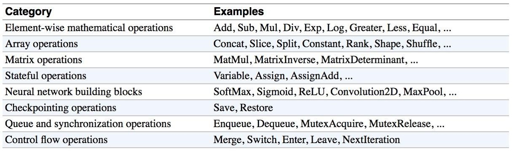
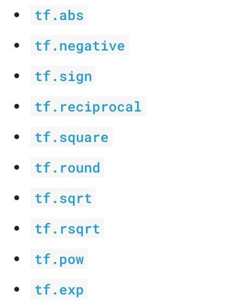
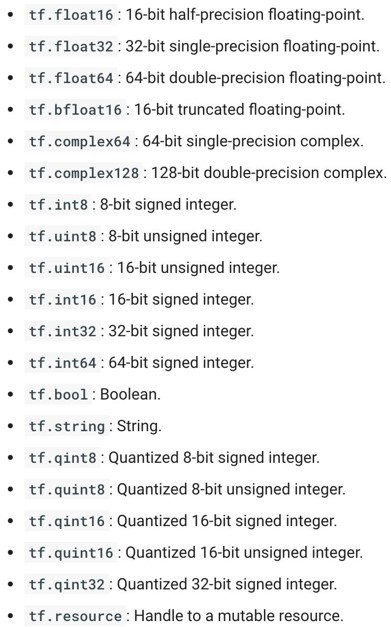

# 1. 警告处理

> Warning?
> The TensorFlow library wasn't compiled to use SSE4.1 instructions, but these are available on your machine and could speed up CPU computations.

> import osos.environ['TF_CPP_MIN_LOG_LEVEL']='2'

# 2. 使用 TensorBoard 可视化计算图

- 首先，编写程序并运行，会在指定目录生成计算图相关文件
```py
import tensorflow as tf

a = tf.constant(2, name='a') # 显式为计算图中的节点命名
b = tf.constant(3, name='b') # 显式为计算图中的节点命名
x = tf.add(a, b, name='add-ab')  # 显式为计算图中的节点命名

# 一般是在计算图定义完毕，在运行会话之前开启 summary 绘制计算图， ./graph 表示绘制的位置，打开时要用到
writer = tf.summary.FileWriter('./graphs', tf.get_default_graph())
with tf.Session() as sess:
    # writer = tf.summary.FileWriter('./graphs', sess.graph)  # 也可以在会话内部绘制
    print(sess.run(x))
writer.close() # 关闭 writer
```
- 确定生成文件的目录，执行 `tensorboard --logdir="包含计算图的目录" --port 6006` 打开 Tensorboard 后台
- 查看命令行输出，按命令行要求访问查看计算图
- 注意在 Jupyter 中，若不重启 Kernel，每次运行完，原来运行过的计算图的内容不会被清除
- 显式命名节点使用 name 参数，当自定义节点命名重复时，TensorFlow 会自动添加后缀

# 3. 基础运算

- 常用基础操作

<div align="center">



</div>

- 基本数学运算

<div align="center">



</div>

- 除法相关运算

```py
a = tf.constant([2, 2], name='a')
b = tf.constant([[0, 1], [2, 3]], name='b')
with tf.Session() as sess:
	print(sess.run(tf.div(b, a)))             ⇒ [[0 0] [1 1]]
	print(sess.run(tf.divide(b, a)))          ⇒ [[0. 0.5] [1. 1.5]]
	print(sess.run(tf.truediv(b, a)))         ⇒ [[0. 0.5] [1. 1.5]]
	print(sess.run(tf.floordiv(b, a)))        ⇒ [[0 0] [1 1]]
	print(sess.run(tf.realdiv(b, a)))         ⇒ # Error: only works for real values
	print(sess.run(tf.truncatediv(b, a)))     ⇒ [[0 0] [1 1]]
	print(sess.run(tf.floor_div(b, a)))       ⇒ [[0 0] [1 1]]
```

# 4. Tensor 类型

## 4.1 Constant

- `tf.constant(value, dtype=None, shape=None, name='Const', verify_shape=False)` 创建常量
- `a = tf.constant([2, 2], name='a')`
- tf 的数组类似 numpy，也可以进行广播

**常见矩阵**

- `tf.zeros(shape, dtype=tf.float32, name=None)` 创建零矩阵
- `tf.zeros([2, 3], tf.int32) ==> [[0, 0, 0], [0, 0, 0]]`
- `tf.zeros_like(input_tensor, dtype=None, name=None, optimize=True)` 创建一个和输入张量同规模同类型的零矩阵（或者手动指定类型），类似 numpy.zeros_like
- `tf.ones(shape, dtype=tf.float32, name=None)` 全一矩阵
- `tf.ones_like(input_tensor, dtype=None, name=None, optimize=True)` 全一矩阵
- `tf.fill(dims, value, name=None)` 矩阵中的所有元素相等
- `tf.fill([2, 3], 8) ==> [[8, 8, 8], [8, 8, 8]]`

**常量序列**

- `tf.lin_space(start, stop, num, name=None)` 产生等间距序列
- `tf.lin_space(10.0, 13.0, 4) ==> [10. 11. 12. 13.]`
- `tf.range(start, limit=None, delta=1, dtype=None, name='range')` 产生 range 序列
- `tf.range(3, 18, 3) ==> [3 6 9 12 15]`
- `tf.range(5) ==> [0 1 2 3 4]`
- 注意该序列和 numpy 中的是不一样的，该序列不可迭代，即不可以用于 for

**随机常量**

- `tf.set_random_seed(seed)` 设置随机种子
- `tf.random_normal`
- `tf.truncated_normal`
- `tf.random_uniform`
- `tf.random_shuffle`
- `tf.random_crop`
- `tf.multinomial`
- `tf.random_gamma`

**常量类型**

- TensorFlow 采用 python 的j基本类型：boolean、numeric、strings
- `tf.zeros_like([b"apple", b"peach", b"grape"])` 返回三个空串表示的字节数组
- TensorFlow 大致包含下述类型：
<div align="center">



</div>

- `tf.int32 == np.int32  # ⇒ True`
- `tf.ones([2, 2], np.float32) 	# ⇒ [[1.0 1.0], [1.0 1.0]]` 可以将 np 类型传递给 tf 运算
- 对于 `tf.Session.run(fetches)`，若 fetch 是一个 Tensor，输出将会是一个 np ndarray

**尽可能使用 TensorFlow 类型**

- 若使用原始 Python 类型，TensorFlow 需要推断其具体类型
- 若使用 npmpy，但 numpy 不兼容 GPU

**常量存在的问题**

- 常量存储在计算图中
- 若常量很大，将使得载入计算图变得十分耗时
- 因此，只对简单的数据使用 constant 类型，对复杂数据和需要大内存的数据要采用 Variable 类型

## 4.2 Variable

- `s = tf.Variable(2, name="scalar")` 使用 tf.Variable 创建变量
- `W = tf.Variable(tf.zeros([784,10]))`
- 也可以使用 `tf.get_variable` 函数创建变量，如下述代码所示：
```py
# create variables with tf.get_variable
s = tf.get_variable("scalar", initializer=tf.constant(2)) 
m = tf.get_variable("matrix", initializer=tf.constant([[0, 1], [2, 3]]))
W = tf.get_variable("big_matrix", shape=(784, 10), initializer=tf.zeros_initializer())
```
- 更推荐使用 `tf.get_variable` 的方式创建变量
- 为什么 tf.constant 首字母小写而 tf.Variable 首字母大写：因为 tf.constant 只含有一个运算，而 tf.Variable 是一个类，其可能包含了多个运算，如下述代码所示：
```py
x = tf.Variable(...) 

x.initializer # init op
x.value() # read op
x.assign(...) # write op
x.assign_add(...) # and more
```
- 在计算变量的值之前要先初始化变量，否则会报错：`FailedPreconditionError: Attempting to use uninitialized value Variable`

**初始化变量**

- 立即初始化所有变量：`sess.run(tf.global_variables_initializer())`
- 注意初始化也是一个 op，需要在 sess.run() 中运行才有效
- 只初始化部分变量：`sess.run(tf.variables_initializer([a, b]))`
- 只初始化一个变量：`sess.run(W.initializer)`

**变量操作**

- 对变量执行 W.eval() 方法相当于 sess.run(W)，如：
```py
# W is a random 700 x 100 variable object
W = tf.Variable(tf.truncated_normal([700, 10]))
with tf.Session() as sess:
	sess.run(W.initializer)
	print(W.eval()) # Similar to print(sess.run(W))
```
- `tf.Variable.assign()`会创建一个 assign 运算，该运算需要在 sess 中运行才会生效
```py
# 构建完计算图后，变量可以通过多次 assign 运算得到不同结果
x = tf.Variable(2)
op = x.assign(x * 2) # op 是一个运算
with tf.Session() as sess:
    sess.run(x.initializer) # 进行初始化
    print(sess.run(x)) # 结果为 2
    sess.run(op) # 执行一次运算
    print(sess.run(x)) # 结果为 4
    sess.run(op) # 再执行一次运算
    print(x.eval()) # 结果为 8
    sess.run(op) # 再执行一次运算
    print(x.eval()) # 结果为 16
```
- 类似的运算还有：assign_add()、assign_sub()
- 注意，每个 session 有自己的变量备份：
```py
W = tf.Variable(10)

sess1 = tf.Session()
sess2 = tf.Session()

sess1.run(W.initializer)
sess2.run(W.initializer)

print(sess1.run(W.assign_add(10))) 		# >> 20
print(sess2.run(W.assign_sub(2))) 		# >> 8

print(sess1.run(W.assign_add(100))) 		# >> 120
print(sess2.run(W.assign_sub(50))) 		# >> -42

sess1.close()
sess2.close()
```

**控制计算序列**

- `tf.Graph.control_dependencies(control_inputs)`，要求参数中的变量序列已经被计算了，才会继续后续计算
```py
# your graph g have 5 ops: a, b, c, d, e
g = tf.get_default_graph()
with g.control_dependencies([a, b, c]):
	# 'd' and 'e' will only run after 'a', 'b', and 'c' have executed.
	d = ...
	e = …
```

# 导入数据

**TensorFlow 程序大致包含下述步骤**

- 组装计算图
- 使用一个 session 计算计算图中的运算

**Placeholder**

- 在组装计算图时，我们往往还没有数据，在训练时才能提供数据，这种时候就需要 Placeholder
- Placeholder 可以用于在组装计算图时暂时还没有数据，但之后执行计算时可以提供所需的数据
- `tf.placeholder(dtype, shape=None, name=None)`
- 在执行 sess.run() 时，使用 feed_dict 提供占位符所表示的数据，其为一个字典结构：
```py
# create a placeholder for a vector of 3 elements, type tf.float32
a = tf.placeholder(tf.float32, shape=[3])

b = tf.constant([5, 5, 5], tf.float32)

# use the placeholder as you would a constant or a variable
c = a + b  # short for tf.add(a, b)

with tf.Session() as sess:
	print(sess.run(c, feed_dict={a: [1, 2, 3]})) 	# the tensor a is the key, not the string ‘a’

# >> [6, 7, 8]
```
- 在创建 palceholder 时，可以定义其类型，若是 None，表示接受任意类型，更容易构建计算图，但会增加 debug 难度，因此建议在创建 placeholder 时同时规定其类型和规模：
```py
# create a placeholder of type float 32-bit, shape is a vector of 3 elements
a = tf.placeholder(tf.float32, shape=[3])

# create a constant of type float 32-bit, shape is a vector of 3 elements
b = tf.constant([5, 5, 5], tf.float32)

# use the placeholder as you would a constant or a variable
c = a + b  # Short for tf.add(a, b)

with tf.Session() as sess:
	print(sess.run(c, {a: [1, 2, 3]}))

# >> [6, 7, 8]
```

- 可以多次执行计算图，每次给 palaceholder 不同的数据，得到不同的计算结果，如下述代码所示：
```py
with tf.Session() as sess:
	for a_value in list_of_values_for_a:
	print(sess.run(c, {a: a_value}))
```

- 其实，在执行 run ，时，可以 feed 任意的 Tensor，只是 placeholder 是必须 feed 的一个节点
```py
# create operations, tensors, etc (using the default graph)
a = tf.add(2, 5)
b = tf.multiply(a, 3)

with tf.Session() as sess:
	# compute the value of b given a is 15
	sess.run(b, feed_dict={a: 15}) # >> 45
```
- 可以使用 `tf.Graph.is_feedable(tensor)` 判断 tensor 是否可以 feed
- 这种策略使得测试变得十分容易，在一个计算图中，测试时可以 feed 虚假数据执行测试

# 懒加载

- 懒加载存在陷阱
- 懒加载：需要数据或对象时才进行创建和初始化
- 下述代码就是一个懒加载样例，其有一个 bug ：
```py
x = tf.Variable(10, name='x')
y = tf.Variable(20, name='y')

writer = tf.summary.FileWriter('./graphs/normal_loading', tf.get_default_graph())
with tf.Session() as sess:
	sess.run(tf.global_variables_initializer())
	for _ in range(10):
		sess.run(tf.add(x, y)) # someone decides to be clever to save one line of code
writer.close()
```
- 上述代码中，由于没有存储 `tf.add(x, y)` 的结果，则每次循环都会重新计算，导致该运算计算了 10 次，若是不采用懒加载，则只会计算一次，这是一个非常隐蔽的 bug

**解决方案**

- 将运算的定义和计算分离开来，用一个变量存储其定义
- 使用 Python 属性确保函数在第一次调用时已经载入
- 